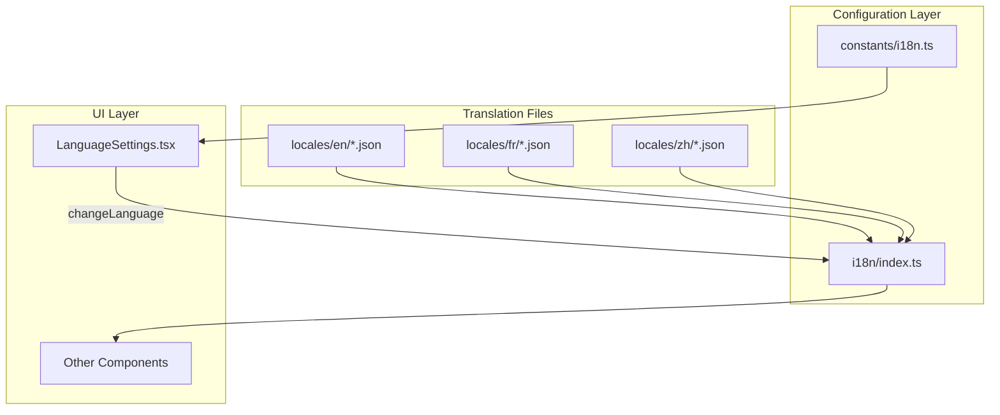
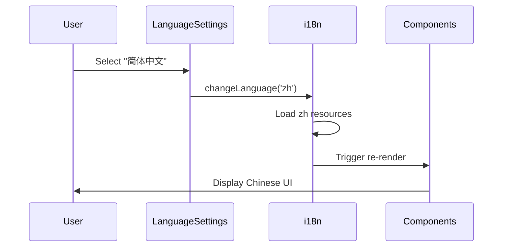

# Feature Design: Chinese Language Support (中文支持)

## Overview

本设计文档描述了为 Auto-Claude 前端应用添加简体中文语言支持的技术实现方案。该功能基于现有的 react-i18next 国际化框架，遵循已有的英语和法语实现模式。

### Key Design Decisions

1. **语言代码**: 使用 `zh` 作为语言代码（与 `en`, `fr` 保持一致的简洁风格）
2. **静态导入**: 沿用现有的静态导入模式，不引入动态加载
3. **完整翻译**: 所有 8 个命名空间必须完整翻译
4. **术语一致性**: 建立术语表确保翻译一致

## Architecture



### Data Flow



## Components and Interfaces

### SupportedLanguage Type (修改)

```typescript
// apps/frontend/src/shared/constants/i18n.ts
export type SupportedLanguage = 'en' | 'fr' | 'zh';

export const AVAILABLE_LANGUAGES = [
  { value: 'en' as const, label: 'English', nativeLabel: 'English' },
  { value: 'fr' as const, label: 'French', nativeLabel: 'Français' },
  { value: 'zh' as const, label: 'Chinese', nativeLabel: '简体中文' }
] as const;

export const DEFAULT_LANGUAGE: SupportedLanguage = 'en';
```

### i18n Resources (修改)

```typescript
// apps/frontend/src/shared/i18n/index.ts

// Import Chinese translation resources (新增)
import zhCommon from './locales/zh/common.json';
import zhNavigation from './locales/zh/navigation.json';
import zhSettings from './locales/zh/settings.json';
import zhTasks from './locales/zh/tasks.json';
import zhWelcome from './locales/zh/welcome.json';
import zhOnboarding from './locales/zh/onboarding.json';
import zhDialogs from './locales/zh/dialogs.json';
import zhTaskReview from './locales/zh/taskReview.json';

export const resources = {
  en: { /* existing */ },
  fr: { /* existing */ },
  zh: {  // 新增
    common: zhCommon,
    navigation: zhNavigation,
    settings: zhSettings,
    tasks: zhTasks,
    welcome: zhWelcome,
    onboarding: zhOnboarding,
    dialogs: zhDialogs,
    taskReview: zhTaskReview
  }
} as const;
```

## Data Models

### Translation File Structure

每个翻译文件必须与英文版本保持相同的 JSON 结构：

```typescript
// 翻译文件接口 (隐式)
interface TranslationNamespace {
  [key: string]: string | TranslationNamespace;
}
```

### Namespace Files

| Namespace | File | Keys (approx) | Description |
|-----------|------|---------------|-------------|
| common | common.json | 115 | 通用按钮、标签、错误、时间 |
| navigation | navigation.json | 32 | 侧边栏导航 |
| settings | settings.json | 306 | 设置页面 |
| tasks | tasks.json | 86 | 任务管理 |
| welcome | welcome.json | 16 | 欢迎屏幕 |
| onboarding | onboarding.json | 93 | 引导向导 |
| dialogs | dialogs.json | 122 | 对话框 |
| taskReview | taskReview.json | 7 | 任务审查 |

## Correctness Properties

### Prework Analysis

```
1.1 WHEN the application initializes, THE I18nModule SHALL recognize 'zh' as a valid SupportedLanguage
  Thoughts: Type system enforces this. Can verify by checking type includes 'zh'.
  Testable: yes - property

1.2 WHEN the LanguageSettings component renders, THE I18nModule SHALL provide Chinese in AVAILABLE_LANGUAGES
  Thoughts: Array membership check. Can verify 'zh' exists with correct labels.
  Testable: yes - property

2.1-2.3 Translation resource registration
  Thoughts: Can verify resources object has 'zh' key with all 8 namespaces.
  Testable: yes - property

3.1-3.8 Translation file completeness
  Thoughts: Can compare zh/*.json keys against en/*.json keys.
  Testable: yes - property (key structure comparison)

4.1-4.3 Language switching
  Thoughts: Can verify i18n.language changes and UI updates.
  Testable: yes - example (requires runtime)

5.1-5.2 Fallback mechanism
  Thoughts: Built into i18next. Can verify with missing key.
  Testable: yes - property

6.1-6.4 Translation quality
  Thoughts: 6.3 (interpolation) is testable, others are manual review.
  Testable: 6.3 yes - property, others no
```

### Properties

**Property 1: Language type includes Chinese**

*For any* valid SupportedLanguage value, the type union SHALL include 'zh' as a valid option, ensuring TypeScript compilation succeeds when using 'zh'.

**Validates: Requirements 1.1**

---

**Property 2: Available languages includes Chinese entry**

*For any* rendering of AVAILABLE_LANGUAGES, there SHALL exist an entry with value 'zh', label 'Chinese', and nativeLabel '简体中文'.

**Validates: Requirements 1.2**

---

**Property 3: Chinese resources registered for all namespaces**

*For any* namespace in ['common', 'navigation', 'settings', 'tasks', 'welcome', 'onboarding', 'dialogs', 'taskReview'], the resources.zh object SHALL contain that namespace as a key.

**Validates: Requirements 2.1, 2.2, 2.3**

---

**Property 4: Translation key completeness**

*For any* translation key path that exists in the English translation file (en/*.json), the corresponding Chinese translation file (zh/*.json) SHALL contain the same key path.

**Validates: Requirements 3.1, 3.2, 3.3, 3.4, 3.5, 3.6, 3.7, 3.8**

---

**Property 5: Interpolation placeholder preservation**

*For any* English translation string containing interpolation placeholders ({{...}}), the corresponding Chinese translation SHALL contain the same placeholders.

**Validates: Requirements 6.3**

---

**Property 6: Fallback to English**

*For any* missing translation key in Chinese resources, the i18n framework SHALL return the English translation value instead of the key itself.

**Validates: Requirements 5.1**

---

## Error Handling

### Error Scenarios

| Scenario | Handling | User Impact |
|----------|----------|-------------|
| Missing translation key | Fallback to English | Sees English text |
| Invalid JSON syntax | Build-time error | None (caught in dev) |
| Missing namespace file | Build-time error | None (caught in dev) |

### Validation Strategy

1. **Build-time**: TypeScript 编译检查导入
2. **Test-time**: 属性测试验证键完整性
3. **Runtime**: i18next fallback 机制

## Testing Strategy

### Property-Based Testing Framework

**Selected Framework**: Vitest (项目已使用)

### Test Configuration

- 属性测试迭代次数: 100
- 测试文件位置: `apps/frontend/src/__tests__/i18n/`

### Unit Tests

```typescript
// apps/frontend/src/__tests__/i18n/chinese-support.test.ts

describe('Chinese Language Support', () => {
  // Property 1: Type includes 'zh'
  it('should include zh in SupportedLanguage type', () => {
    const lang: SupportedLanguage = 'zh';
    expect(['en', 'fr', 'zh']).toContain(lang);
  });

  // Property 2: AVAILABLE_LANGUAGES includes Chinese
  it('should include Chinese in AVAILABLE_LANGUAGES', () => {
    const chinese = AVAILABLE_LANGUAGES.find(l => l.value === 'zh');
    expect(chinese).toBeDefined();
    expect(chinese?.label).toBe('Chinese');
    expect(chinese?.nativeLabel).toBe('简体中文');
  });

  // Property 3: All namespaces registered
  it('should register all namespaces for zh', () => {
    const namespaces = ['common', 'navigation', 'settings', 'tasks',
                        'welcome', 'onboarding', 'dialogs', 'taskReview'];
    namespaces.forEach(ns => {
      expect(resources.zh).toHaveProperty(ns);
    });
  });
});
```

### Property Tests

```typescript
// apps/frontend/src/__tests__/i18n/translation-completeness.test.ts

import { describe, it, expect } from 'vitest';
import enCommon from '@/shared/i18n/locales/en/common.json';
import zhCommon from '@/shared/i18n/locales/zh/common.json';

// Property 4: Key completeness
describe('Translation Key Completeness', () => {
  function getAllKeys(obj: object, prefix = ''): string[] {
    return Object.entries(obj).flatMap(([key, value]) => {
      const path = prefix ? `${prefix}.${key}` : key;
      if (typeof value === 'object' && value !== null) {
        return getAllKeys(value, path);
      }
      return [path];
    });
  }

  it('zh/common.json should have all keys from en/common.json', () => {
    const enKeys = getAllKeys(enCommon);
    const zhKeys = getAllKeys(zhCommon);
    enKeys.forEach(key => {
      expect(zhKeys).toContain(key);
    });
  });

  // Repeat for other namespaces...
});

// Property 5: Interpolation preservation
describe('Interpolation Placeholder Preservation', () => {
  function getInterpolations(str: string): string[] {
    const matches = str.match(/\{\{[^}]+\}\}/g);
    return matches || [];
  }

  function checkInterpolations(enObj: object, zhObj: object, path = '') {
    Object.entries(enObj).forEach(([key, enValue]) => {
      const currentPath = path ? `${path}.${key}` : key;
      const zhValue = (zhObj as any)[key];

      if (typeof enValue === 'string' && typeof zhValue === 'string') {
        const enPlaceholders = getInterpolations(enValue).sort();
        const zhPlaceholders = getInterpolations(zhValue).sort();
        expect(zhPlaceholders, `Mismatch at ${currentPath}`).toEqual(enPlaceholders);
      } else if (typeof enValue === 'object') {
        checkInterpolations(enValue, zhValue, currentPath);
      }
    });
  }

  it('should preserve interpolation placeholders in common.json', () => {
    checkInterpolations(enCommon, zhCommon);
  });
});
```

### Test Organization

```
apps/frontend/src/__tests__/
└── i18n/
    ├── chinese-support.test.ts      # Property 1-3
    ├── translation-completeness.test.ts  # Property 4
    └── interpolation.test.ts        # Property 5
```

## File Changes Summary

| File | Action | Description |
|------|--------|-------------|
| `apps/frontend/src/shared/constants/i18n.ts` | Modify | 添加 'zh' 到类型和数组 |
| `apps/frontend/src/shared/i18n/index.ts` | Modify | 导入并注册中文资源 |
| `apps/frontend/src/shared/i18n/locales/zh/common.json` | Create | 通用翻译 |
| `apps/frontend/src/shared/i18n/locales/zh/navigation.json` | Create | 导航翻译 |
| `apps/frontend/src/shared/i18n/locales/zh/settings.json` | Create | 设置翻译 |
| `apps/frontend/src/shared/i18n/locales/zh/tasks.json` | Create | 任务翻译 |
| `apps/frontend/src/shared/i18n/locales/zh/welcome.json` | Create | 欢迎翻译 |
| `apps/frontend/src/shared/i18n/locales/zh/onboarding.json` | Create | 引导翻译 |
| `apps/frontend/src/shared/i18n/locales/zh/dialogs.json` | Create | 对话框翻译 |
| `apps/frontend/src/shared/i18n/locales/zh/taskReview.json` | Create | 任务审查翻译 |
| `apps/frontend/src/__tests__/i18n/*.test.ts` | Create | 测试文件 |

---

## 审批状态

- [ ] 用户确认技术方案
- [ ] 用户确认正确性属性
- [ ] 用户批准进入 Phase 4

---

**下一步**: 用户批准后，进入 Phase 4 编写任务清单 (03-tasks.md)
