# Auto-Claude 项目架构深度分析

> 基于对 Auto-Claude 项目代码的系统性分析
> 分析日期：2025-12-22
> 项目版本：v2.7.1

---

## 目录

1. [项目整体架构](#1-项目整体架构)
2. [CLI 工具设计模式](#2-cli-工具设计模式)
3. [Agent 系统架构](#3-agent-系统架构)
4. [核心技术实现](#4-核心技术实现)
5. [代码组织最佳实践](#5-代码组织最佳实践)
6. [核心设计模式总结](#6-核心设计模式总结)
7. [关键技术决策](#7-关键技术决策)
8. [可借鉴的最佳实践](#8-可借鉴的最佳实践)

---

## 1. 项目整体架构

### 1.1 核心架构图

```mermaid
graph TB
    subgraph "CLI Layer"
        CLI[cli/main.py<br/>命令行入口]
        CLI --> BuildCmd[build_commands]
        CLI --> SpecCmd[spec_commands]
        CLI --> QACmd[qa_commands]
        CLI --> WorkspaceCmd[workspace_commands]
    end

    subgraph "Spec Creation Pipeline"
        SpecRunner[spec_runner.py<br/>规格创建流程]
        SpecRunner --> Discovery[Discovery Phase]
        SpecRunner --> Requirements[Requirements Phase]
        SpecRunner --> Research[Research Phase]
        SpecRunner --> Context[Context Phase]
        SpecRunner --> SpecWriter[Spec Writer Phase]
        SpecRunner --> Planner[Planning Phase]
        SpecRunner --> Validate[Validation Phase]
    end

    subgraph "Agent System"
        AgentOrchestrator[core/agent.py<br/>Agent 编排器]
        AgentOrchestrator --> PlannerAgent[Planner Agent<br/>创建实施计划]
        AgentOrchestrator --> CoderAgent[Coder Agent<br/>实现代码]
        AgentOrchestrator --> QAReviewer[QA Reviewer<br/>验证质量]
        AgentOrchestrator --> QAFixer[QA Fixer<br/>修复问题]

        PlannerAgent --> SessionMgr[agents/session.py<br/>会话管理]
        CoderAgent --> SessionMgr
        QAReviewer --> SessionMgr
        QAFixer --> SessionMgr
    end

    subgraph "Core Services"
        Client[core/client.py<br/>Claude SDK 客户端]
        Worktree[core/worktree.py<br/>Git Worktree 隔离]
        Security[security.py<br/>安全模型]
        Memory[memory/main.py<br/>会话记忆系统]

        Client --> Security
        Client --> ProjectAnalyzer[analysis/project_analyzer.py<br/>项目分析器]
    end

    subgraph "Data Layer"
        ImplPlan[implementation_plan.json<br/>实施计划]
        SpecMD[spec.md<br/>需求规格]
        ContextJSON[context.json<br/>上下文信息]
        MemoryFiles[memory/<br/>会话记忆文件]
    end

    CLI --> SpecRunner
    CLI --> AgentOrchestrator
    AgentOrchestrator --> Client
    AgentOrchestrator --> Worktree
    AgentOrchestrator --> Memory
    SessionMgr --> ImplPlan
    SessionMgr --> Memory
```



### 1.2 模块依赖关系

**核心依赖层次：**

```
CLI Layer (用户交互)
    ↓
Command Handlers (命令处理)
    ↓
Agent Orchestrator (Agent 编排)
    ↓
Core Services (核心服务)
    ↓
Claude SDK Client (AI 交互)
    ↓
Security & Isolation (安全隔离)
```

### 1.3 数据流

```
用户输入 → CLI 解析 → 命令路由 → Agent 编排
    ↓
创建 Worktree (隔离环境)
    ↓
加载 Spec & Context (需求上下文)
    ↓
创建 Claude Client (配置安全策略)
    ↓
运行 Agent Session (AI 执行任务)
    ↓
Post-Session Processing (会话后处理)
    ↓
更新 Memory & Plan (记忆和计划)
    ↓
Git Commit (提交变更)
    ↓
返回结果给用户
```

---

## 2. CLI 工具设计模式

### 2.1 命令行参数解析

**设计模式：** Command Pattern + Strategy Pattern

**关键特性：**

1. **互斥组（Mutually Exclusive Groups）**：确保冲突的选项不能同时使用
2. **布尔标志（Boolean Flags）**：简化命令行接口
3. **默认值策略**：合理的默认值减少用户输入

```python
def parse_args() -> argparse.Namespace:
    parser = argparse.ArgumentParser(
        description="Auto Claude Framework - Autonomous multi-session coding agent"
    )

    # 核心命令
    parser.add_argument("--list", action="store_true")
    parser.add_argument("--spec", type=str)

    # 工作空间选项（互斥组）
    workspace_group = parser.add_mutually_exclusive_group()
    workspace_group.add_argument("--isolated", action="store_true")
    workspace_group.add_argument("--direct", action="store_true")

    # 构建管理命令（互斥组）
    build_group = parser.add_mutually_exclusive_group()
    build_group.add_argument("--merge", action="store_true")
    build_group.add_argument("--review", action="store_true")
    build_group.add_argument("--discard", action="store_true")

    return parser.parse_args()
```

### 2.2 子命令组织方式

**模块化命令处理器：**

```
cli/
├── main.py              # 入口和路由
├── build_commands.py    # 构建相关命令
├── spec_commands.py     # Spec 管理命令
├── qa_commands.py       # QA 验证命令
├── workspace_commands.py # 工作空间管理命令
├── followup_commands.py # 后续任务命令
└── utils.py            # 共享工具函数
```

**命令路由逻辑：**

```python
def main() -> None:
    args = parse_args()

    # 列表命令
    if args.list:
        print_specs_list(project_dir, args.dev)
        return

    # 工作空间管理
    if args.merge:
        handle_merge_command(...)
        return

    # QA 命令
    if args.qa:
        handle_qa_command(...)
        return

    # 默认：构建命令
    handle_build_command(...)
```

### 2.3 配置管理

**环境变量处理：**

```python
# 优先级：命令行参数 > 环境变量 > 默认值
model = args.model or os.environ.get("AUTO_BUILD_MODEL", DEFAULT_MODEL)
oauth_token = os.environ.get("CLAUDE_CODE_OAUTH_TOKEN")
base_branch = args.base_branch or os.environ.get("DEFAULT_BRANCH")
```

**配置文件：**

- `.env` - 环境变量配置
- `.claude_settings.json` - Claude SDK 安全设置
- `.auto-claude-security.json` - 项目安全配置缓存

---

## 3. Agent 系统架构

### 3.1 Agent 类型和职责

| Agent 类型 | 职责 | 输入 | 输出 |
|-----------|------|------|------|
| **Planner** | 创建实施计划 | spec.md, context.json | implementation_plan.json |
| **Coder** | 实现代码变更 | 单个 subtask | 代码提交 |
| **QA Reviewer** | 验证质量标准 | 完成的构建 | qa_report.md |
| **QA Fixer** | 修复 QA 问题 | QA_FIX_REQUEST.md | 修复提交 |
| **Followup Planner** | 添加后续任务 | FOLLOWUP_REQUEST.md | 更新的 plan |

### 3.2 Agent 协作机制

**自主 Agent 循环：**

```python
async def run_autonomous_agent(
    project_dir: Path,
    spec_dir: Path,
    model: str,
    max_iterations: int | None = None,
) -> bool:
    """
    运行自主 Agent 循环：
    1. Planner 创建计划
    2. Coder 实现 subtasks
    3. QA Reviewer 验证
    4. QA Fixer 修复问题（循环）
    """

    # Phase 1: Planning
    planner_success = await run_planner_session(...)

    # Phase 2: Implementation Loop
    while has_pending_subtasks():
        subtask = find_next_subtask()
        coder_success = await run_coder_session(subtask)

        if not coder_success:
            recovery_success = await run_recovery_session(subtask)

    # Phase 3: QA Validation
    qa_success = await run_qa_reviewer(...)

    # Phase 4: QA Fix Loop
    while qa_has_issues():
        await run_qa_fixer(...)
        qa_success = await run_qa_reviewer(...)

    return is_build_complete()
```

**关键协作模式：**

1. **顺序执行**：Planner → Coder → QA Reviewer → QA Fixer
2. **循环修复**：QA Fixer 和 QA Reviewer 形成反馈循环
3. **恢复机制**：Coder 失败时触发 Recovery Agent
4. **并行支持**：Coder 可以生成 subagents 并行工作

### 3.3 Prompt 工程组织

**Prompt 目录结构：**

```
prompts/
├── planner.md              # 创建实施计划
├── coder.md                # 实现代码
├── coder_recovery.md       # 恢复失败的 subtask
├── qa_reviewer.md          # QA 验证
├── qa_fixer.md             # 修复 QA 问题
├── followup_planner.md     # 添加后续任务
├── spec_gatherer.md        # 收集需求
├── spec_researcher.md      # 研究外部集成
├── spec_writer.md          # 编写规格文档
├── spec_critic.md          # 自我批评
└── complexity_assessor.md  # 复杂度评估
```

**Prompt 设计原则：**

1. **上下文感知**：每个 prompt 包含环境信息（工作目录、spec 位置）
2. **步骤化指导**：明确的步骤（STEP 1, STEP 2...）
3. **检查清单**：强制性的质量检查点
4. **示例驱动**：提供具体的命令和代码示例
5. **记忆集成**：指导 Agent 读取和更新会话记忆

---

## 4. 核心技术实现

### 4.1 Git Worktree 隔离机制

**设计模式：** Facade Pattern + Repository Pattern

**核心特性：**

```python
class WorktreeManager:
    """
    每个 spec 获得独立的 worktree：
    - Worktree 路径: .worktrees/{spec-name}/
    - 分支名称: auto-claude/{spec-name}
    """

    def create_worktree(self, spec_name: str) -> WorktreeInfo:
        """创建隔离的 worktree"""
        worktree_path = self.get_worktree_path(spec_name)
        branch_name = self.get_branch_name(spec_name)

        # 创建新分支和 worktree
        result = self._run_git([
            "worktree", "add",
            "-b", branch_name,
            str(worktree_path),
            self.base_branch
        ])

        return WorktreeInfo(
            path=worktree_path,
            branch=branch_name,
            spec_name=spec_name,
            base_branch=self.base_branch
        )
```

**关键特性：**

1. **1:1:1 映射**：一个 spec → 一个 worktree → 一个分支
2. **并行工作**：多个 spec 可以同时开发
3. **安全隔离**：每个 spec 的变更完全隔离
4. **本地优先**：所有工作保持本地，用户控制何时推送

### 4.2 三层安全模型

**Defense in Depth 架构：**

```python
def create_client(
    project_dir: Path,
    spec_dir: Path,
    model: str,
    agent_type: str = "coder",
) -> ClaudeSDKClient:
    """
    三层安全防御：
    1. OS Sandbox - Bash 命令隔离
    2. Filesystem Permissions - 限制到项目目录
    3. Command Allowlist - 动态命令白名单
    """

    security_settings = {
        "sandbox": {
            "enabled": True,
            "autoAllowBashIfSandboxed": True
        },
        "permissions": {
            "defaultMode": "acceptEdits",
            "allow": [
                "Read(./**)",
                "Write(./**)",
                "Edit(./**)",
                "Bash(*)",  # 由 Layer 3 控制
            ]
        }
    }

    return ClaudeSDKClient(
        options=ClaudeAgentOptions(
            hooks={
                "PreToolUse": [
                    HookMatcher(
                        matcher="Bash",
                        hooks=[bash_security_hook]
                    )
                ]
            },
            cwd=str(project_dir.resolve()),
        )
    )
```

**动态命令白名单：**

- 项目分析器检测技术栈（Python, Node.js, PostgreSQL 等）
- 根据检测结果生成定制的命令白名单
- 解析 package.json scripts、Makefile targets
- 缓存配置到 `.auto-claude-security.json`

### 4.3 双层内存系统

**架构：** File-based (Primary) + Graphiti (Optional Enhancement)

```python
async def save_session_memory(...) -> tuple[bool, str]:
    """
    双层内存架构：
    1. Graphiti (Primary) - 图数据库，语义搜索
    2. File-based (Fallback) - 零依赖，始终可用
    """

    # 尝试 Graphiti（如果启用）
    if is_graphiti_memory_enabled():
        try:
            await save_session_to_graphiti(...)
            return True, "graphiti"
        except Exception as e:
            logger.warning(f"Graphiti failed: {e}, using file-based")

    # Fallback: File-based memory
    save_session_insights(...)
    return True, "file-based"
```

**File-based Memory 结构：**

```
specs/001-feature/memory/
├── codebase_map.json          # 文件用途映射
├── patterns.md                # 代码模式
├── gotchas.md                 # 已知陷阱
└── session_insights/
    ├── session_001.json
    ├── session_002.json
    └── session_003.json
```

### 4.4 任务执行和恢复机制

```python
class RecoveryManager:
    """
    跟踪失败的尝试并提供恢复策略：
    - 记录每次尝试的方法和错误
    - 识别重复失败的模式
    - 建议替代方法
    """

    def should_try_recovery(self, subtask_id: str) -> bool:
        """判断是否应该尝试恢复"""
        attempts = self.get_attempt_count(subtask_id)
        return attempts >= 2 and attempts < MAX_RECOVERY_ATTEMPTS

    def get_recovery_context(self, subtask_id: str) -> str:
        """生成恢复上下文（给 recovery agent）"""
        attempts = self.history.get(subtask_id, [])

        context = f"Previous {len(attempts)} attempts failed:\n\n"
        for i, attempt in enumerate(attempts, 1):
            context += f"Attempt {i}:\n"
            context += f"  Approach: {attempt['approach']}\n"
            context += f"  Error: {attempt['error']}\n\n"

        return context
```

---

## 5. 代码组织最佳实践

### 5.1 目录结构设计原则

**模块化分层架构：**

```
auto-claude/
├── cli/                    # CLI 层（用户交互）
├── core/                   # 核心服务层
├── agents/                 # Agent 实现层
├── analysis/               # 项目分析层
├── memory/                 # 记忆系统层
├── spec/                   # Spec 创建管道
├── qa/                     # QA 验证层
├── prompts/                # Prompt 模板
└── ui/                     # UI 组件
```

**设计原则：**

1. **单一职责**：每个模块专注一个功能领域
2. **依赖倒置**：高层模块不依赖低层模块
3. **接口隔离**：小而专注的接口
4. **开闭原则**：对扩展开放，对修改关闭

### 5.2 模块化和解耦策略

**Facade Pattern（外观模式）：**

```python
# 旧的单体模块被重构为包，保持向后兼容

# implementation_plan.py (facade)
from implementation_plan import *
from implementation_plan.main import *

# security.py (facade)
from security import *
```

**依赖注入：**

```python
class AgentRunner:
    def __init__(
        self,
        project_dir: Path,
        spec_dir: Path,
        model: str,
        task_logger: TaskLogger | None = None,  # 可选依赖
    ):
        self.task_logger = task_logger  # 注入而非硬编码
```

**策略模式（Agent 类型）：**

```python
def create_client(
    agent_type: str = "coder",  # 策略选择
) -> ClaudeSDKClient:
    """根据 agent 类型选择不同的工具集"""

    if agent_type == "planner":
        allowed_tools = PLANNER_TOOLS
    elif agent_type == "coder":
        allowed_tools = CODER_TOOLS
    elif agent_type in ("qa_reviewer", "qa_fixer"):
        allowed_tools = QA_TOOLS + BROWSER_TOOLS

    return ClaudeSDKClient(allowed_tools=allowed_tools)
```

### 5.3 错误处理和日志记录

**分层日志系统：**

```python
# task_logger/ - 持久化任务日志
class TaskLogger:
    """记录任务执行的详细日志"""

    def log(self, message: str, entry_type: LogEntryType, phase: LogPhase):
        entry = {
            "timestamp": datetime.now().isoformat(),
            "type": entry_type.value,
            "phase": phase.value,
            "message": message
        }
        self._append_to_log(entry)

# debug.py - 开发调试日志
def debug(module: str, message: str, **kwargs):
    if DEBUG_ENABLED:
        print(f"[DEBUG:{module}] {message}", kwargs)

# ui/status.py - 用户友好的状态显示
def print_status(message: str, status: str):
    icon = STATUS_ICONS[status]
    print(f"{icon} {message}")
```

---

## 6. 核心设计模式总结

### 6.1 使用的设计模式

| 模式 | 应用位置 | 目的 |
|------|---------|------|
| **Command Pattern** | CLI 命令处理 | 封装命令为对象 |
| **Strategy Pattern** | Agent 类型选择 | 运行时选择策略 |
| **Facade Pattern** | 模块重构 | 简化复杂接口 |
| **Repository Pattern** | Worktree 管理 | 抽象数据访问 |
| **Observer Pattern** | 任务日志 | 事件通知 |
| **Factory Pattern** | Client 创建 | 对象创建逻辑 |
| **Template Method** | Agent 会话 | 定义算法骨架 |
| **Chain of Responsibility** | 安全钩子 | 请求处理链 |

### 6.2 架构模式

1. **分层架构（Layered Architecture）**
   - CLI Layer → Command Layer → Service Layer → Data Layer

2. **管道和过滤器（Pipeline & Filters）**
   - Spec Creation Pipeline: Discovery → Requirements → Research → Context → Spec → Plan → Validate

3. **事件驱动架构（Event-Driven）**
   - Agent 会话通过事件钩子（PreToolUse, PostToolUse）进行扩展

---

## 7. 关键技术决策

### 7.1 为什么选择 Git Worktree？

**决策：** 使用 Git worktree 而非分支切换

**理由：**
- ✅ 并行开发多个 spec
- ✅ 完全隔离，不影响主分支
- ✅ 用户可以在 worktree 中测试
- ✅ 避免频繁的 git checkout

### 7.2 为什么使用三层安全模型？

**决策：** OS Sandbox + Filesystem Permissions + Command Allowlist

**理由：**
- ✅ Defense in Depth（纵深防御）
- ✅ 动态白名单适应不同项目
- ✅ 平衡安全性和灵活性
- ✅ 用户可以审查和调整安全配置

### 7.3 为什么使用双层内存系统？

**决策：** File-based (Primary) + Graphiti (Optional)

**理由：**
- ✅ File-based 零依赖，始终可用
- ✅ Graphiti 提供语义搜索增强
- ✅ 优雅降级，不会因为 Graphiti 失败而中断
- ✅ 用户可以选择是否启用高级功能

### 7.4 为什么使用 Subtask-based Plan？

**决策：** 基于 subtask 的实施计划而非单体任务

**理由：**
- ✅ 更好的进度跟踪
- ✅ 支持并行执行（subagents）
- ✅ 更容易恢复失败的部分
- ✅ 更清晰的依赖关系

---

## 8. 可借鉴的最佳实践

### 8.1 CLI 工具设计

1. **命令互斥组**：使用 `add_mutually_exclusive_group()` 防止冲突选项
2. **配置优先级**：命令行参数 > 环境变量 > 默认值
3. **模块化命令**：将命令处理器分离到独立模块
4. **友好的错误消息**：提供可操作的错误提示

### 8.2 Agent 系统设计

1. **明确的 Agent 职责**：每个 Agent 专注单一任务
2. **Prompt 工程**：结构化的 prompt（步骤、检查清单、示例）
3. **会话记忆**：记录 patterns、gotchas、insights
4. **恢复机制**：跟踪失败尝试，提供替代方法

### 8.3 安全设计

1. **纵深防御**：多层安全机制
2. **动态白名单**：根据项目技术栈生成
3. **安全钩子**：在工具使用前验证
4. **配置缓存**：避免重复分析

### 8.4 代码组织

1. **分层架构**：清晰的层次划分
2. **Facade 模式**：保持向后兼容
3. **依赖注入**：提高可测试性
4. **策略模式**：运行时选择行为

### 8.5 错误处理

1. **分层日志**：任务日志、调试日志、用户状态
2. **优雅降级**：Graphiti 失败时使用 file-based
3. **特定异常**：定义领域特定的异常类
4. **上下文管理器**：确保资源清理

---

## 9. 总结

Auto-Claude 是一个设计精良的自主编码框架，展示了以下核心优势：

### 9.1 架构优势

- **模块化设计**：清晰的层次划分，易于维护和扩展
- **安全优先**：三层安全模型确保 AI 操作的安全性
- **隔离机制**：Git worktree 提供完全隔离的开发环境
- **智能恢复**：自动识别失败模式并尝试替代方法

### 9.2 工程实践

- **Prompt 工程**：结构化、步骤化的 prompt 设计
- **记忆系统**：双层架构平衡可用性和功能性
- **错误处理**：分层日志和优雅降级
- **代码组织**：遵循 SOLID 原则和设计模式

### 9.3 用户体验

- **CLI 友好**：清晰的命令结构和互斥组
- **进度可见**：实时显示任务执行状态
- **安全可控**：用户完全控制何时合并和推送
- **灵活配置**：支持环境变量和配置文件

---

## 附录

### A. 关键文件清单

| 文件 | 职责 |
|------|------|
| `cli/main.py` | CLI 入口和命令路由 |
| `core/client.py` | Claude SDK 客户端封装 |
| `core/worktree.py` | Git worktree 管理 |
| `agents/session.py` | Agent 会话管理 |
| `security.py` | 安全钩子和验证 |
| `memory/main.py` | 会话记忆系统 |
| `prompts/coder.md` | Coder Agent prompt |
| `prompts/planner.md` | Planner Agent prompt |

### B. 技术栈

- **语言**：Python 3.10+
- **AI SDK**：Claude Code SDK
- **UI 框架**：Electron + React 18
- **状态管理**：Zustand
- **样式**：TailwindCSS
- **组件库**：Radix UI
- **图数据库**：LadybugDB (Graphiti)
- **版本控制**：Git worktree

### C. 参考资源

- [Auto-Claude GitHub](https://github.com/AndyMik90/Auto-Claude)
- [Claude Code SDK](https://github.com/anthropics/claude-code)
- [Git Worktree 文档](https://git-scm.com/docs/git-worktree)
- [Graphiti Memory](https://github.com/getzep/graphiti)

---

**文档版本：** 1.0
**最后更新：** 2025-12-22
**分析者：** Claude Code Analysis Agent
