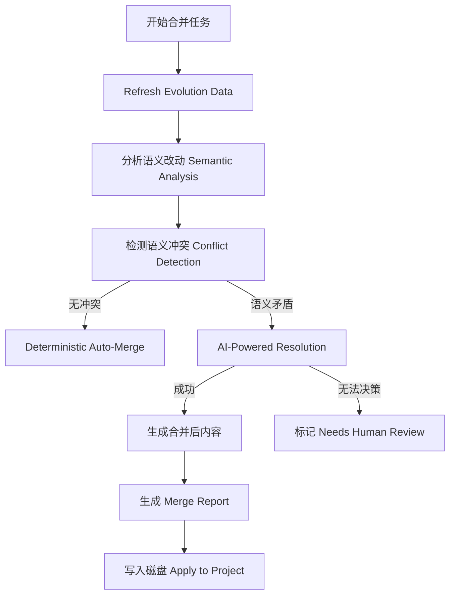

# Auto-Claude AI 智能合并冲突系统深度解析

**日期**: 2025-12-22
**分析对象**: Intent-Aware Merge System (`apps/backend/merge/`)

---

## 1. 核心理念：意图感知合并 (Intent-Aware Merge)

传统的 Git 合并是**基于行**的（Line-based）。如果两个开发者修改了同一行，Git 就会报错。Auto-Claude 引入了**意图感知**逻辑：它理解代码改动的“语义”，从而能够自动合并那些 Git 认为冲突但逻辑上互补的改动。

---

## 2. 架构组件 (Core Components)

位于 `apps/backend/merge/`，系统由以下核心模块驱动：

### 2.1 演变追踪器 (`FileEvolutionTracker`)
- **功能**: 记录文件从 `main` 分支到各个 `worktree` 任务分支的完整演化路径。
- **作用**: 提供合并所需的“三方对比”（Base, Task A, Task B）上下文。

### 2.2 语义分析器 (`SemanticAnalyzer`)
- **功能**: 利用 AST 或正则表达式分析代码的结构化变化。
- **作用**: 识别改动是“新增函数”、“重命名变量”还是“逻辑修改”。

### 2.3 冲突检测器 (`ConflictDetector`)
- **功能**: 识别**语义冲突**。
- **示例**: 任务 A 删除了函数 `init()`，而并行运行的任务 B 正在往 `init()` 内部添加逻辑。Git 可能不报错，但系统会识别出这种语义上的“硬冲突”。

### 2.4 AI 解析器 (`AIResolver`)
- **功能**: 系统的“大脑”。
- **策略**: **Conflict-Only 模式**。仅将冲突关联的代码片段（而非全文件）发送给 Claude，要求其根据双方意图合成最终代码。

---

## 3. 合并流水线流程 (The Pipeline)

---

## 4. 技术黑科技：如何降低 AI 成本？

Auto-Claude 在合并时非常“吝啬” Token，主要通过以下技术：
1.  **精确切割**: 只有在 `AutoMerger`（确定性算法）失效时才调用 AI。
2.  **上下文最小化**: 使用 `ConflictRegion` 类型只包裹冲突点前后的核心上下文。
3.  **结果验证**: AI 合并后的代码会进行语法检查，确保合并结果不破坏代码结构。

---

## 5. 关键代码位置

- **主入口**: `merge/orchestrator.py` -> `MergeOrchestrator` 类。
- **AI 逻辑**: `merge/ai_resolver.py`。
- **自动逻辑**: `merge/auto_merger.py`。
- **预览功能**: `handle_merge_preview_command` (用于给 UI 返回冲突 JSON)。

---

## 6. 总结

Auto-Claude 的合并系统是其作为“多 Agent 并行框架”的基石。
- **安全性**: 三层过滤（算法 -> AI -> 人工）。
- **智能性**: 能够处理传统 Git 无法处理的逻辑合并。
- **透明度**: 生成详尽的 JSON 报告，用户可以在 UI 上清晰看到 AI 为什么这么合并。
