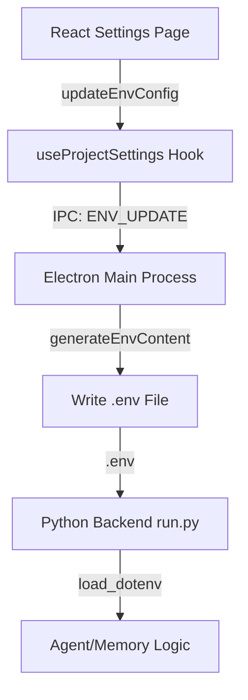

# Auto-Claude UI 配置系统与同步机制分析

**日期**: 2025-12-22
**分析对象**: Auto-Claude-UI (Electron/React) 与 Python 后端的配置交互

---

## 1. 系统架构逻辑 (Architectural Logic)

Auto-Claude 的 UI 配置系统采用了 **"UI 为表，环境变量为里"** 的设计模式。所有的界面操作最终都会转化为项目目录下的 `.env` 文件条目。

### 1.1 配置流向图

---

## 2. 核心组件解析

### 2.1 环境变量处理器 (`env-handlers.ts`)
位于 `src/main/ipc-handlers/env-handlers.ts`，这是连接前后端的枢纽。
- **解析逻辑**: 使用 `parseEnvFile` 读取现有 `.env`，确保保留用户的手动注释。
- **生成逻辑**: `generateEnvContent` 函数负责将前端传入的配置对象映射为 Python 后端识别的变量名（如 `GRAPHITI_ENABLED`, `OLLAMA_BASE_URL`）。

### 2.2 记忆配置组件 (`SecuritySettings.tsx`)
尽管名字叫 "Security"，但它实际上是记忆系统的主要配置界面：
- **动态渲染**: 根据 `embeddingProvider` 的值（`ollama`, `openai`, `voyage` 等），动态显示或隐藏 API Key 输入框。
- **全局 vs 私有**: 支持从全局设置中继承 API Key（如 OpenAI Key），同时也允许项目级别覆盖。

---

## 3. 记忆系统配置项详解

在 UI 界面上，记忆系统的配置被细分为以下维度：

| 配置项 | 环境变量 | 说明 |
|------|------|------|
| **Enable Memory** | `GRAPHITI_ENABLED` | 控制是否启用基于知识图谱的长期记忆。 |
| **Embedding Provider** | `GRAPHITI_EMBEDDER_PROVIDER` | 选择向量化模型提供商（Ollama, OpenAI...）。 |
| **Ollama Model** | `OLLAMA_EMBEDDING_MODEL` | 本地运行时的模型名称。 |
| **MCP Server URL** | N/A (Project Setting) | 用于 Agent 实时访问内存的 MCP 服务端点。 |
| **Database Path** | `GRAPHITI_DB_PATH` | 自定义 LadybugDB 的本地存储位置。 |

---

## 4. 同步原理：如何实现“所见即所得”？

1.  **加载阶段**: 当用户切换项目或打开设置时，UI 发送 `ENV_GET` 请求。主进程读取 `.env`，解析后返回给前端，填充输入框。
2.  **修改阶段**: 用户输入字符时，Hook 内部维护状态。
3.  **保存阶段**: 点击 "Save" 时，Hook 将整个配置对象推送到主进程。主进程生成新的 `.env` 内容并覆盖文件。
4.  **生效阶段**: 这是一个**延迟生效**机制。Python 进程在每次执行任务（Spawn）时都会重新加载环境变量，因此 UI 的修改对下一个 Agent 会话立即可见。

---

## 5. 总结

Auto-Claude 的配置系统设计非常稳健，它避开了复杂的数据库同步，转而使用最原始但也最可靠的 `.env` 文件作为“单一事实来源”。

**魔改建议**:
如果您想支持新的 Provider（例如 DeepSeek 或本地其他框架），只需：
1.  在 `env-handlers.ts` 的 `generateEnvContent` 中添加变量映射。
2.  在 `SecuritySettings.tsx` 中添加对应的 UI 输入框。
3.  在 Python 端的 `integrations/graphiti/config.py` 中添加读取逻辑。
