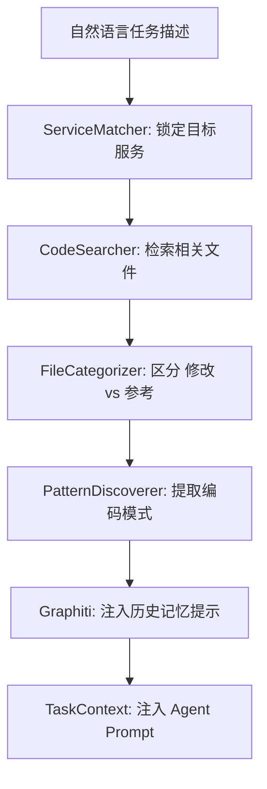

# Auto-Claude 上下文工程与项目理解机制深度解析

**日期**: 2025-12-22
**分析对象**: Context Engineering Suite (`auto-claude/context/`)

---

## 1. 核心理念：精准上下文 (Precision Context)

AI 编程最大的挑战是“上下文过载”或“上下文缺失”。Auto-Claude 不会将整个代码库丢给 AI，而是通过一套复杂的**上下文工程流水线**，为每个 Subtask 量身定制最相关的代码片段和背景知识。

---

## 2. 架构组件 (Key Components)

位于 `auto-claude/context/` 目录，系统由以下核心模块驱动：

### 2.1 项目索引器 (`project_index.json`)
- **功能**: 构建项目的“数字孪生”。
- **内容**: 包含服务列表（Services）、语言占比、框架类型、核心目录（如 `routes`, `components`）。
- **优化**: 仅在依赖配置文件变动时增量更新。

### 2.2 服务匹配器 (`ServiceMatcher`)
- **算法**: 基于权重的评分机制。
- **逻辑**: 分析任务描述中的动词和名词，匹配 `project_index` 中的服务元数据。
- **示例**: 任务包含 "endpoint" -> 后端服务加 5 分；包含 "button" -> 前端服务加 5 分。

### 2.3 模式发现引擎 (`PatternDiscoverer`)
- **功能**: “以史为鉴”。
- **原理**: 扫描 `Files to Reference`，提取现有的命名规范、错误处理模式和 API 调用习惯。
- **作用**: 确保 Agent 生成的代码风格与项目原生代码高度一致。

---

## 3. 上下文构建流水线 (Context Pipeline)

---

## 4. 人工干预机制：`SERVICE_CONTEXT.md`

这是系统预留给架构师的**最高权限控制点**：
- **逻辑**: 如果服务目录下存在 `SERVICE_CONTEXT.md`，系统会将其内容作为该服务的“终极指南”注入 Context。
- **建议**: 在 AMEUREKA 框架下，可以为每个模块编写此文件，明确规定该模块的架构约束（如：禁止在此层级直接操作数据库）。

---

## 5. 对 AMEUREKA 协作的启示

1.  **增强索引**: 我们可以修改 `analyzer.py`，使其能识别 AMEUREKA 特有的目录结构（如 `.kiro/` 目录）。
2.  **自定义模式**: 将 AMEUREKA 的“黄金代码片段”放入 `Reference` 目录，通过 `PatternDiscoverer` 强制 Agent 模仿。

---

## 6. 总结

Auto-Claude 的上下文工程是其**“地道编码”**的秘密。它通过：
- **自动 scoping**（缩小范围）
- **语义分类**（修改 vs 参考）
- **模式提取**（模仿风格）
实现了在保持低 Token 消耗的同时，提供高质量的生成指导。
