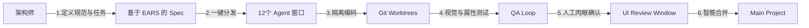

# Auto-Claude 与 AMEUREKA 框架协作及前端质控方案汇总

**日期**: 2025-12-22
**分析对象**: 跨框架协作、前置工程准备、前端 UI 自动化测试体系

---

## 1. 核心协作架构：蜂群引擎 + 规范导航

在 `ameureka` 框架下使用 `Auto-Claude` 的核心逻辑是：**“蜂群干活（执行），框架管人（约束）”**。

### 1.1 规格说明书 (Spec) 的深度融合
- **策略**: 禁止 Agent 随意发挥，将 `ameureka` 的 `requirements.standard.md` 注入到 `spec_writer.md` 中。
- **效果**: 蜂群生成的每一个 Subtask 从诞生起就带有 AMEUREKA 基因（如 EARS 模式表达、组件拆分约束）。

### 1.2 v0 前端代码的“蜂群式迁移”
- **并行逻辑**: 利用 12 个并发窗口，将 v0 的单文件面条代码进行物理拆解：
    - **窗口 1-4**: 负责 UI 组件原子化。
    - **窗口 5-8**: 负责业务逻辑 Hooks 提取。
    - **窗口 9-12**: 负责 API 及 Lib 层重构。
- **保障**: 利用 `Worktree` 物理隔离，确保大规模重构不产生文件锁冲突。

---

## 2. 开发者前置准备指南 (Digital Factory Readiness)

为了发挥“数字工厂”的最大效率，开发者需提前准备以下“原材料”：

### 2.1 架构基因库 (`project_context.md`)
- **内容**: 定义全局目录规范（Hooks vs Components vs Lib）、命名约定、状态管理策略。
- **用途**: 每个新启动的终端窗口都会读取此文件进行“初始化洗脑”。

### 2.2 环境工具链白名单 (`Allowlist`)
- **内容**: 修改 `auto-claude/security/process_validators.py`。
- **操作**: 预先授权 `pnpm`, `npx drizzle-kit`, `tsc` 等框架特有命令。
- **用途**: 消除 Agent 执行过程中的“安全拦截报错”，确保自动化流水线无断点。

### 2.3 黄金验收标准 (EARS Requirements)
- **内容**: 使用 EARS 模式（`When... Then...`）编写的高质量需求文档。
- **用途**: 作为 `QA Loop` 的判定基准，不符合 AMEUREKA 规范的代码严禁 Sign-off。

---

## 3. 前端 UI 完整性测试体系

针对“代码写完但 UI 不对”的问题，建立三层防御：

### 3.1 激活视觉验证 (Visual MCP)
- **技术**: 启用 `PUPPETEER_TOOLS` 或 `ELECTRON_TOOLS`。
- **流程**: 在 Subtask 中显式要求 Agent 编写 `*.spec.ts` 截图测试脚本。QA Agent 会启动无头浏览器，截取 UI 快照并进行语义比对。

### 3.2 属性驱动的路径遍历 (Property-Based Testing)
- **理念**: 利用 `ameureka` 规范中定义的正确性属性。
- **操作**: QA Agent 循环执行属性检查（例如：Loading 状态下提交按钮必须 Disbaled）。
- **反馈**: 捕获浏览器 Console 报错并自动触发 `QA Fixer` 进行自我修复。

### 3.3 环境编排闭环 (Service Orchestration)
- **技术**: 利用 `services/orchestrator.py` 管理多服务。
- **操作**: 准备 `docker-compose.test.yml` 或 Mock Server。
- **效果**: 前端 UI 测试时，系统自动启动并等待临时后端 Ready，确保测试环境的真实性。

---

## 4. 架构师操作流 (Final Workflow)

## 5. 总结

要玩转这套工具，重点在于**“设计测试的陷阱”**。让 AI 在你预设好的规范“轨道”和测试“围栏”内运行。你不需要纠结代码怎么写，而要纠结**验收标准怎么定**。
