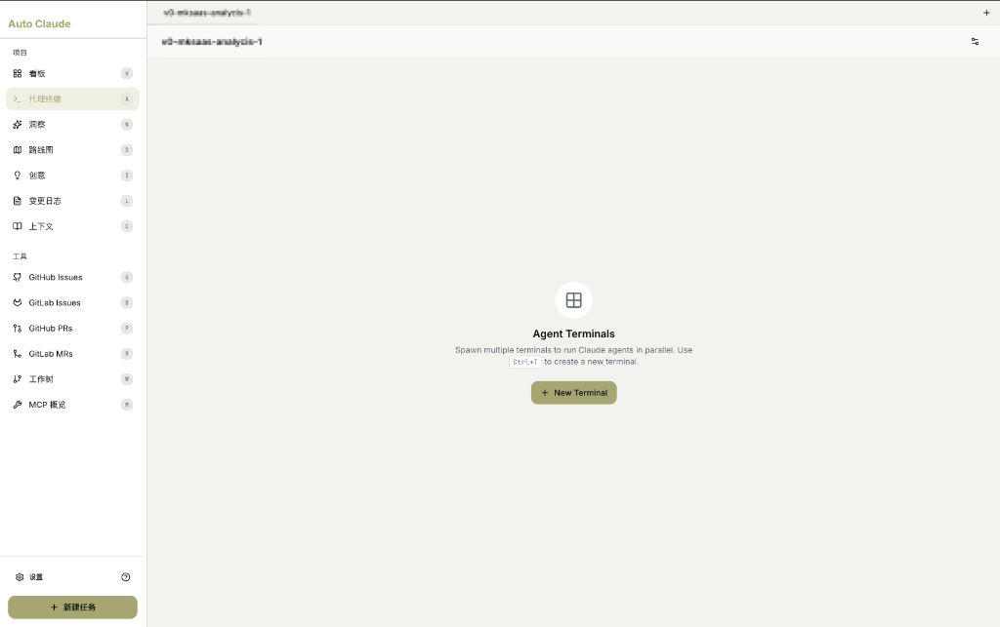
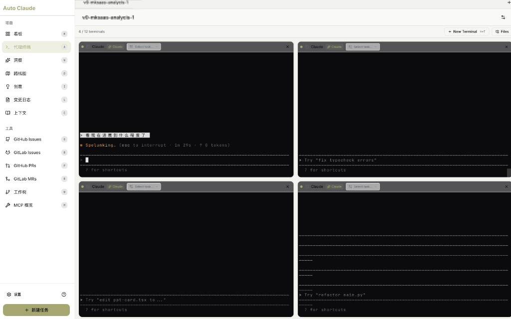

# 代理终端 (Agent Terminals)

代理终端页面让您实时观察和交互 AI 代理的工作过程。

---

## 功能概述

代理终端可以：

- 👀 **实时监控**：观察 AI 执行任务的完整过程
- 🖥️ **并行运行**：同时运行多个终端处理不同任务
- ⌨️ **交互控制**：暂停、恢复、输入指令
- 📁 **文件管理**：查看和管理终端相关文件

---

## 空状态

首次进入代理终端页面时显示：



### 界面说明

> "Agent Terminals"
>
> "Spawn multiple terminals to run Claude agents in parallel. Use `Ctrl+T` to create a new terminal."
>
> **翻译**：代理终端 - 生成多个终端来并行运行 Claude 代理。使用 `Ctrl+T` 创建新终端。

点击 **+ New Terminal** 创建新终端。

---

## 多终端运行视图

当有任务执行时，可同时显示多个终端：



### 界面结构

| 区域 | 说明 |
|------|------|
| **顶部栏** | 终端数量统计 + New Terminal + Files |
| **终端网格** | 2x2 或更多终端窗口布局 |
| **单个终端** | 带标题栏的独立终端窗口 |

### 顶部栏说明

| 元素 | 示例 | 说明 |
|------|------|------|
| **终端计数** | `4 / 12 terminals` | 当前活跃终端数 / 总终端数 |
| **+ New Terminal** | `Alt+T` | 创建新终端的快捷键 |
| **📁 Files** | | 打开文件管理器 |

---

## 单个终端窗口

每个终端窗口包含：

### 标题栏

| 元素 | 说明 |
|------|------|
| **窗口控制** | 🔴 🟡 🟢 关闭/最小化/最大化 |
| **Claude 标签** | 显示 "Claude" 表示连接状态 |
| **✅ Claude** | 绿色勾表示代理已就绪 |
| **Select task** | 选择要执行的任务 |
| **× 关闭** | 关闭终端窗口 |

### 终端内容

| 元素 | 说明 |
|------|------|
| **输出区** | 显示 AI 的思考和操作过程 |
| **状态指示** | 如 `● Spelunking.. (esc to interrupt - 1m 29s - ↑ 0 tokens)` |
| **输入提示** | `> ` 等待用户输入 |
| **快捷键提示** | `? for shortcuts` |

### 状态指示详解

```
● Spelunking.. (esc to interrupt - 1m 29s - ↑ 0 tokens)
│      │              │            │           │
│      │              │            │           └── Token 消耗
│      │              │            └── 运行时间
│      │              └── ESC 键中断
│      └── 当前动作（探索/思考/编码等）
└── 运行状态指示灯
```

### 输入提示示例

终端底部显示建议输入：
- `> Try "fix typecheck errors"`
- `> Try "edit pat-card.tsx to ..."`
- `> Try "refactor main.py"`

---

## 快捷键

| 快捷键 | 功能 |
|--------|------|
| **Ctrl+T / Alt+T** | 新建终端 |
| **ESC** | 中断当前操作 |
| **Ctrl+C** | 暂停执行 |
| **Ctrl+C Ctrl+C** | 强制终止 |
| **?** | 显示快捷键列表 |

---

## 终端类型

| 类型 | 用途 | 何时出现 |
|------|------|----------|
| **通用终端** | 手动创建的交互终端 | 手动新建 |
| **任务终端** | 自动为任务创建 | 任务开始时 |
| **Planner** | 规划实现方案 | 任务规划阶段 |
| **Coder** | 编写代码 | 编码阶段 |
| **QA Reviewer** | 验证代码质量 | QA 阶段 |

---

## 后台运行机制

> **重要**：代理终端在后台持续运行，无需保持页面打开。

| 特性 | 说明 |
|------|------|
| **后台执行** | 切换到其他页面，任务继续执行 |
| **状态同步** | 结果同步到看板卡片 |
| **按需查看** | 需要时再打开终端页面 |
| **断点恢复** | 应用重启后可恢复任务 |

---

## 看板与终端的关系

> **常见问题**：启动任务后，终端会自动弹出吗？

**答案：终端窗口会创建，但不会自动跳转显示。**

### 启动任务时的行为

```
1. 在看板点击「开始」
        │
        ▼
2. 系统自动创建终端（在后台）
        │
        ▼
3. 页面保持在看板，不会自动跳转
        │
        ▼
4. 手动点击「代理终端」菜单才能看到终端窗口
```

### 两者是什么关系？

| 方面 | 看板 | 代理终端 |
|------|------|----------|
| **角色** | 任务管理视图 | 任务执行视图 |
| **显示** | 卡片状态 | 实时输出 |
| **操作** | 启动/停止任务 | 输入指令/交互 |
| **关系** | **同一任务的两个视角** | |

### 视觉说明

```
┌──────────────────────────────────────────────────────┐
│  当您在看板启动任务后...                              │
├──────────────────────────────────────────────────────┤
│                                                      │
│   看板页面（您当前看到的）     代理终端页面           │
│   ┌────────────────────┐      ┌─────────────┐        │
│   │ 任务 A             │      │ 终端 1      │        │
│   │ "In Progress" ✓    │◄─────│ (隐藏中)    │        │
│   │ 进度条更新中...     │ 同步 │ Spelunking │        │
│   └────────────────────┘      └─────────────┘        │
│                                                      │
│   📍 您在这里看状态      需要点击菜单才能看到 👆     │
└──────────────────────────────────────────────────────┘
```

### 何时需要查看终端？

| 场景 | 建议 |
|------|------|
| 日常任务 | 看板查看状态即可 |
| 调试问题 | 切换到终端看详细输出 |
| 引导 AI | 切换到终端输入指令 |
| 任务卡住 | 终端查看错误信息 |

---

## 交互指南

### 查看执行详情

1. 点击左侧菜单「代理终端」
2. 找到对应任务的终端窗口
3. 滚动查看历史输出

### 输入指令引导 AI

当看到 `>` 提示符时，可以输入：
```
> 优先处理登录功能的 Bug
> 先阅读 README.md 了解项目结构
> 不要修改数据库 schema
```

### 中断和恢复

1. 按 **ESC** 暂停 AI
2. 查看当前进度
3. 输入新指令或按回车继续

---

## 相关页面

- [看板视图](kanban-board.md)
- [任务创建](task-creation.md)
- [核心概念：任务与 Worktree](../02-concepts/task-and-worktree.md)
