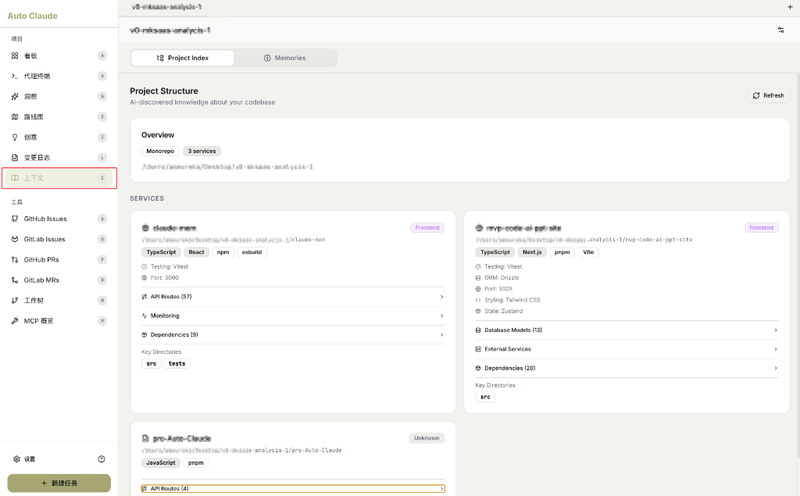
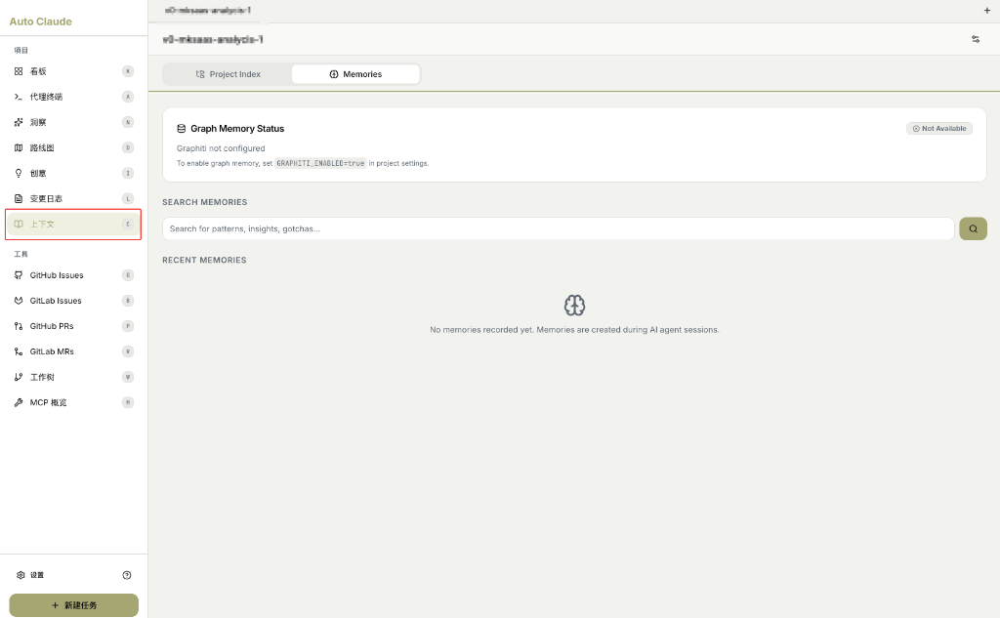
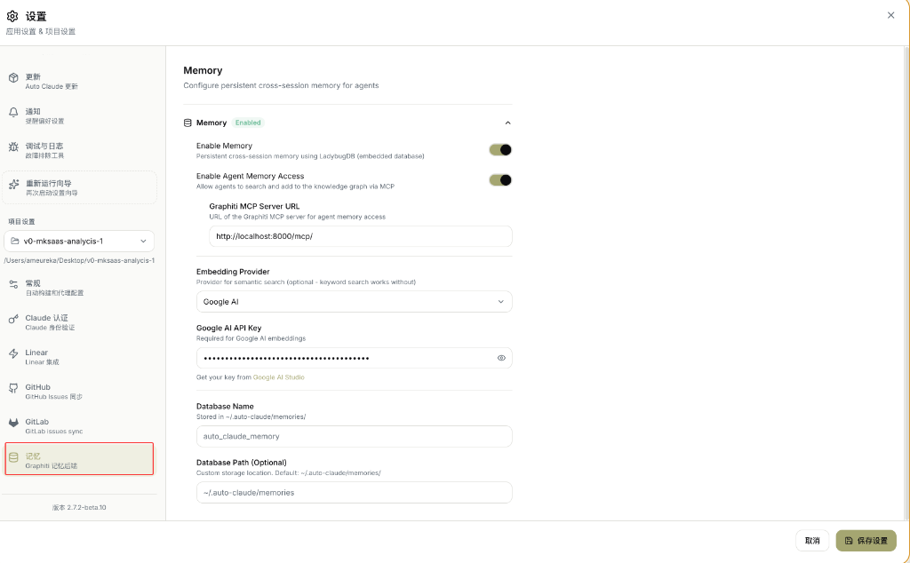

# 上下文 (Context)

AI 对项目的理解和记忆管理中心。

---

## 功能概述

上下文页面包含两个核心功能：

- 🔍 **Project Index**：AI 发现的项目结构和技术栈
- 🧠 **Memories**：AI 在执行任务过程中积累的记忆

---

## 标签页切换

页面顶部提供两个标签：

| 标签 | 图标 | 功能 |
|------|------|------|
| **Project Index** | 📊 | 项目结构索引 |
| **Memories** | 🧠 | AI 记忆管理 |

---

## Project Index（项目索引）



### 界面说明

> "Project Structure"
>
> "AI-discovered knowledge about your codebase"
>
> **翻译**：项目结构 - AI 发现的代码库知识

### Overview（概览）

| 字段 | 示例 | 说明 |
|------|------|------|
| **项目类型** | `Monorepo` | 单仓/多仓结构 |
| **服务数量** | `3 services` | 项目包含的服务数 |
| **路径** | `/Users/.../v0-mksaas-analysis-1` | 项目根目录 |

### SERVICES（服务列表）

每个服务显示详细信息卡片：

| 字段 | 说明 | 示例 |
|------|------|------|
| **服务名称** | 服务标识 | `claude-ten`, `nvp-code-ai-ppt-site` |
| **类型标签** | Frontend/Backend/Unknown | `Frontend` |
| **技术栈** | 使用的框架和工具 | `TypeScript`, `React`, `Next.js` |
| **Testing** | 测试框架 | `Vitest` |
| **ORM** | 数据库 ORM | `Drizzle` |
| **Port** | 开发端口 | `3000`, `3005` |
| **Styling** | CSS 方案 | `Tailwind CSS` |
| **State** | 状态管理 | `Zustand` |
| **API Routes** | API 路由数量 | `(57)`, `(4)` |
| **Database Models** | 数据库模型数 | `(13)` |
| **External Services** | 外部服务 | 展开查看 |
| **Dependencies** | 依赖数量 | `(9)`, `(20)` |
| **Key Directories** | 关键目录 | `src`, `tests` |

### 服务卡片示例

```
┌─────────────────────────────────────────┐
│ 📦 claude-ten                  Frontend │
│ /Users/.../claude-ten                   │
├─────────────────────────────────────────┤
│ TypeScript  React  npm  esbuild         │
│                                         │
│ ⚙️ Testing: Vitest                      │
│ 🌐 Port: 3000                           │
├─────────────────────────────────────────┤
│ 📡 API Routes (57)                    > │
│ 📊 Monitoring                         > │
│ 📦 Dependencies (9)                   > │
├─────────────────────────────────────────┤
│ Key Directories                         │
│ [src] [tests]                           │
└─────────────────────────────────────────┘
```

### 刷新按钮

点击右上角 **🔄 Refresh** 重新扫描项目结构。

---

## Memories（记忆）



### 界面说明

此页面管理 AI 在任务执行过程中积累的记忆。

### Graph Memory Status（图记忆状态）

| 状态 | 说明 |
|------|------|
| **Not Available** | 图记忆未启用 |
| **Available** | 图记忆已启用 |

> "Graphiti not configured"
>
> "To enable graph memory, set `GRAPHITI_ENABLED=true` in project settings."
>
> **翻译**：Graphiti 未配置。要启用图记忆，请在项目设置中设置 `GRAPHITI_ENABLED=true`。

### SEARCH MEMORIES（搜索记忆）

输入框可搜索已保存的记忆：

```
Search for patterns, insights, gotchas...
```

**翻译**：搜索模式、洞察、注意事项...

### RECENT MEMORIES（最近记忆）

空状态显示：

> "No memories recorded yet. Memories are created during AI agent sessions."
>
> **翻译**：尚无记忆。记忆在 AI 代理会话期间创建。

### 记忆的作用

| 作用 | 说明 |
|------|------|
| **跨任务学习** | AI 记住之前任务的经验 |
| **避免重复错误** | 记录踩过的坑 |
| **项目模式** | 记住项目的约定和模式 |
| **快速上手** | 新任务可利用历史记忆 |

---

## 记忆设置详解

在设置页面可配置记忆功能：



### 界面说明

> "Memory"
>
> "Configure persistent cross-session memory for agents"
>
> **翻译**：记忆 - 为代理配置持久化跨会话记忆

### 配置选项

| 字段 | 说明 | 示例值 |
|------|------|--------|
| **Enable Memory** | 启用记忆功能 | ✅ 开启 |
| **Enable Agent Memory Access** | 允许代理搜索和添加知识图谱 | ✅ 开启 |
| **Graphiti MCP Server URL** | Graphiti MCP 服务器地址 | `http://localhost:8000/mcp/` |
| **Embedding Provider** | 嵌入向量提供商 | `Google AI` |
| **Google AI API Key** | Google AI 的 API 密钥 | `••••••••••••` |
| **Database Name** | 数据库名称 | `auto_claude_memory` |
| **Database Path** | 数据库存储路径 | `~/.auto-claude/memories` |

### 各选项详解

#### Enable Memory（启用记忆）

> "Persistent cross-session memory using LadybugDB (embedded database)"
>
> **翻译**：使用 LadybugDB（嵌入式数据库）实现持久化跨会话记忆

**作用**：开启后，AI 会在任务执行中保存记忆。

#### Enable Agent Memory Access（代理记忆访问）

> "Allow agents to search and add to the knowledge graph via MCP"
>
> **翻译**：允许代理通过 MCP 搜索和添加知识图谱

**作用**：开启后，AI 可以主动查询和更新记忆。

#### Graphiti MCP Server URL

> "URL of the Graphiti MCP server for agent memory access"
>
> **翻译**：用于代理记忆访问的 Graphiti MCP 服务器 URL

**默认值**：`http://localhost:8000/mcp/`

#### Embedding Provider（嵌入提供商）

> "Provider for semantic search (optional - keyword search works without)"
>
> **翻译**：语义搜索提供商（可选 - 不配置时使用关键字搜索）

| 选项 | 说明 |
|------|------|
| **Google AI** | 使用 Google AI 嵌入 |
| **OpenAI** | 使用 OpenAI 嵌入 |
| **None** | 仅关键字搜索 |

#### Google AI API Key

> "Required for Google AI embeddings"
>
> "Get your key from [Google AI Studio](https://aistudio.google.com/)"
>
> **翻译**：Google AI 嵌入所需。从 Google AI Studio 获取密钥。

#### Database Name（数据库名称）

> "Stored in ~/.auto-claude/memories/"
>
> **翻译**：存储在 ~/.auto-claude/memories/ 目录

**默认值**：`auto_claude_memory`

#### Database Path（数据库路径）

> "Custom storage location. Default: ~/.auto-claude/memories/"
>
> **翻译**：自定义存储位置。默认：~/.auto-claude/memories/

---

## 配置步骤总结

1. **打开设置** → 点击左侧「记忆」菜单
2. **启用记忆** → 打开 Enable Memory 开关
3. **启用代理访问** → 打开 Enable Agent Memory Access
4. **选择嵌入提供商** → 推荐 Google AI
5. **填写 API Key** → 从 Google AI Studio 获取
6. **保存设置** → 点击「保存设置」按钮

---

## 相关页面

- [设置向导](onboarding-wizard.md)
- [任务创建](task-creation.md)
- [代理终端](agent-terminals.md)
