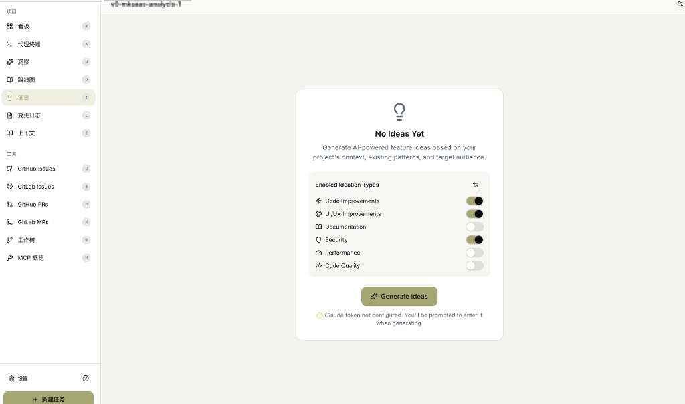
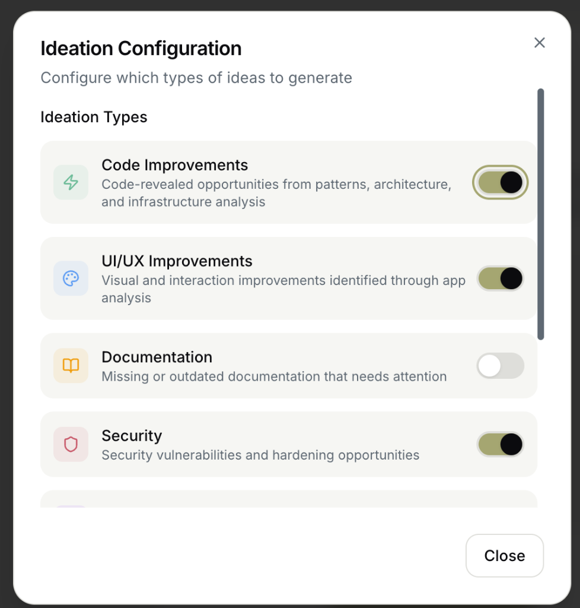
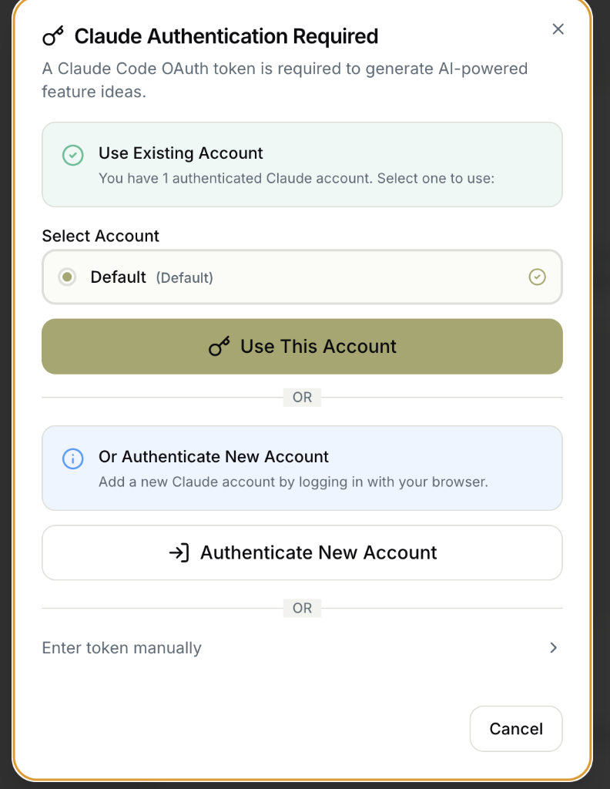

# 创意 (Ideas)

AI 驱动的功能创意生成器，基于项目分析自动发现改进机会。

---

## 功能概述

创意功能可以：

- 🤖 **AI 分析项目**：分析代码模式、架构和基础设施
- 💡 **生成改进建议**：识别代码、UI/UX、安全等方面的改进机会
- 🎯 **分类管理**：按类型筛选和管理创意
- ✨ **转换为任务**：将创意直接转换为开发任务

---

## 空状态

首次进入创意页面时显示：

### 界面说明

> "No Ideas Yet"
>
> "Generate AI-powered feature ideas based on your project's context, existing patterns, and target audience."
>
> **翻译**：尚无创意。基于项目上下文、现有模式和目标受众生成 AI 驱动的功能创意。

### 创意类型开关

页面显示 6 种创意类型，可开启/关闭：

| 类型 | 图标 | 说明 | 默认状态 |
|------|------|------|----------|
| **Code Improvements** | ⚡ | 代码改进 | ✅ 开启 |
| **UI/UX Improvements** | 🎨 | 界面/体验改进 | ✅ 开启 |
| **Documentation** | 📚 | 文档改进 | ❌ 关闭 |
| **Security** | 🔒 | 安全改进 | ✅ 开启 |
| **Performance** | 🚀 | 性能改进 | ❌ 关闭 |
| **Code Quality** | 📏 | 代码质量 | ❌ 关闭 |

点击 **✨ Generate Ideas** 开始生成。

### ⚠️ 认证提示

> "Claude token not configured. You'll be prompted to enter it when generating."
>
> **翻译**：Claude 令牌未配置。生成时会提示您输入。

---

## 配置对话框

点击设置图标可配置创意类型：

### 界面说明

> "Ideation Configuration"
>
> "Configure which types of ideas to generate"
>
> **翻译**：创意配置 - 配置要生成的创意类型

### 类型详细说明

| 类型 | 英文描述 | 中文翻译 |
|------|----------|----------|
| **Code Improvements** | Code-revealed opportunities from patterns, architecture, and infrastructure analysis | 从模式、架构和基础设施分析中发现的代码改进机会 |
| **UI/UX Improvements** | Visual and interaction improvements identified through app analysis | 通过应用分析识别的视觉和交互改进 |
| **Documentation** | Missing or outdated documentation that needs attention | 需要关注的缺失或过时文档 |
| **Security** | Security vulnerabilities and hardening opportunities | 安全漏洞和加固机会 |
| **Performance** | Performance optimization opportunities | 性能优化机会 |
| **Code Quality** | Code quality and maintainability improvements | 代码质量和可维护性改进 |

---

## 认证选择

生成时如需认证，显示选择对话框：

### 界面说明

> "Claude Authentication Required"
>
> "A Claude Code OAuth token is required to generate AI-powered feature ideas."
>
> **翻译**：需要 Claude 认证。需要 Claude Code OAuth 令牌才能生成 AI 驱动的功能创意。

### 认证选项

| 选项 | 说明 |
|------|------|
| **Use Existing Account** | 使用已认证的 Claude 账户 |
| **Authenticate New Account** | 通过浏览器登录添加新账户 |
| **Enter token manually** | 手动输入令牌 |

### 账户选择

如果有多个已认证账户，可从列表选择：
- 显示账户名称（如 "Default"）
- 点击 **Use This Account** 使用选中账户

---

## 生成完成后

生成完成后显示创意列表：

### 创意卡片

每个创意显示：
- 创意标题
- 创意描述
- 类型标签（Code/UI/Security 等）
- 优先级
- 操作按钮

### 创意操作

| 操作 | 说明 |
|------|------|
| **Convert to Task** | 将创意转换为开发任务 |
| **Dismiss** | 忽略此创意 |
| **View Details** | 查看详细说明 |

---

## 使用建议

| 场景 | 推荐类型 |
|------|----------|
| **代码重构** | Code Improvements + Code Quality |
| **用户体验优化** | UI/UX Improvements |
| **安全审计** | Security |
| **性能调优** | Performance |
| **新手上手** | Documentation |

---

## 相关页面

- [路线图](roadmap.md)
- [任务创建](task-creation.md)
- [设置向导](onboarding-wizard.md)
