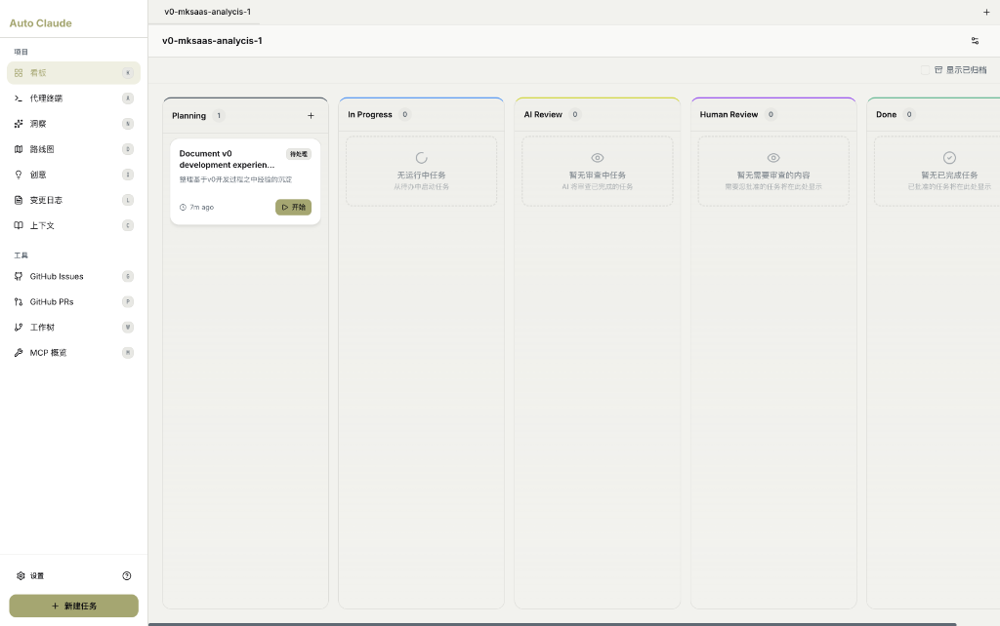
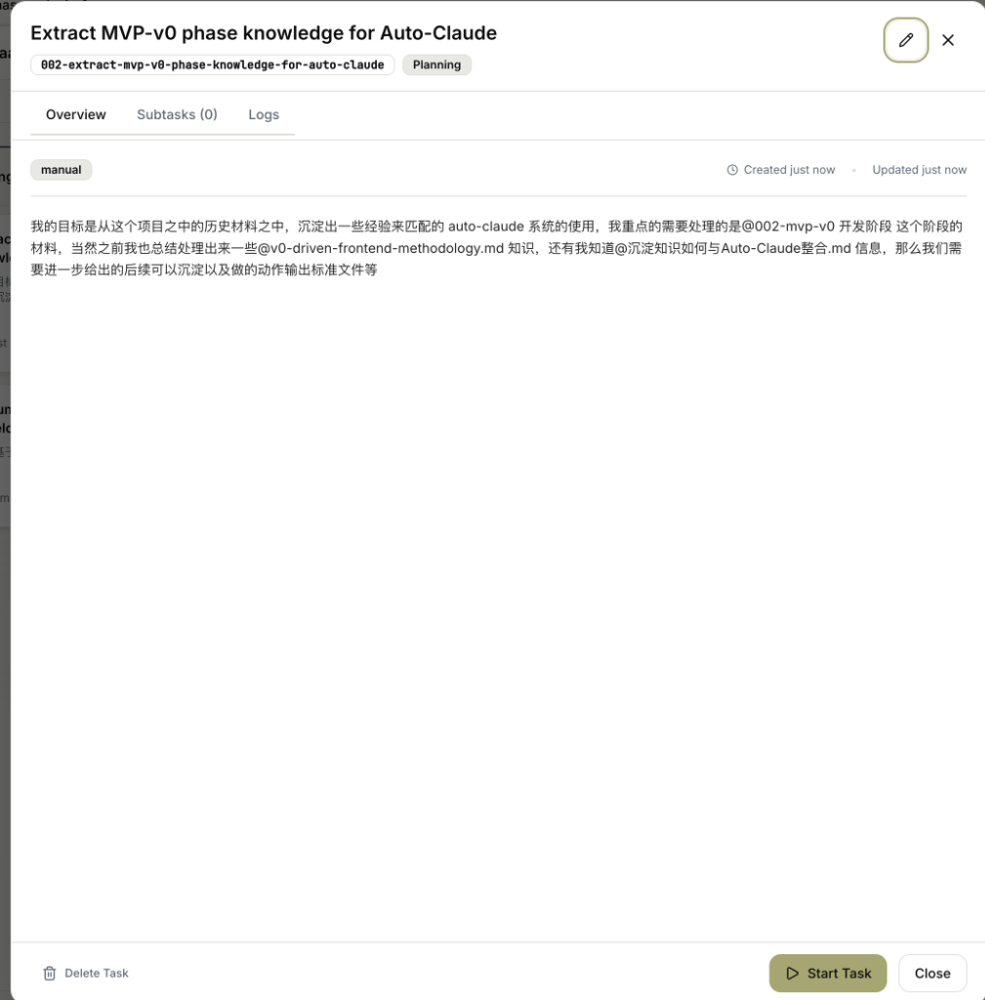
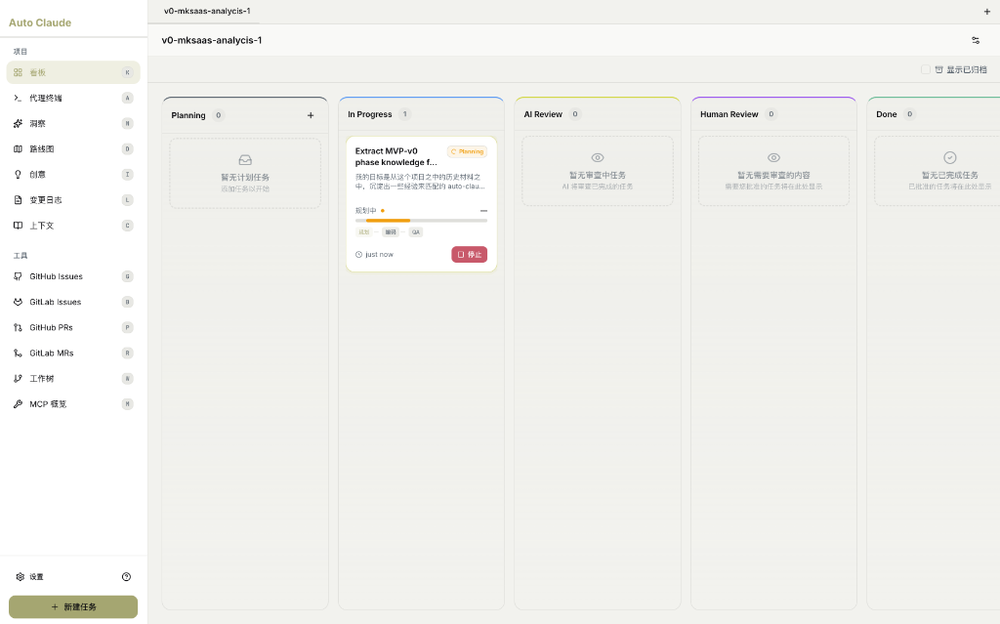
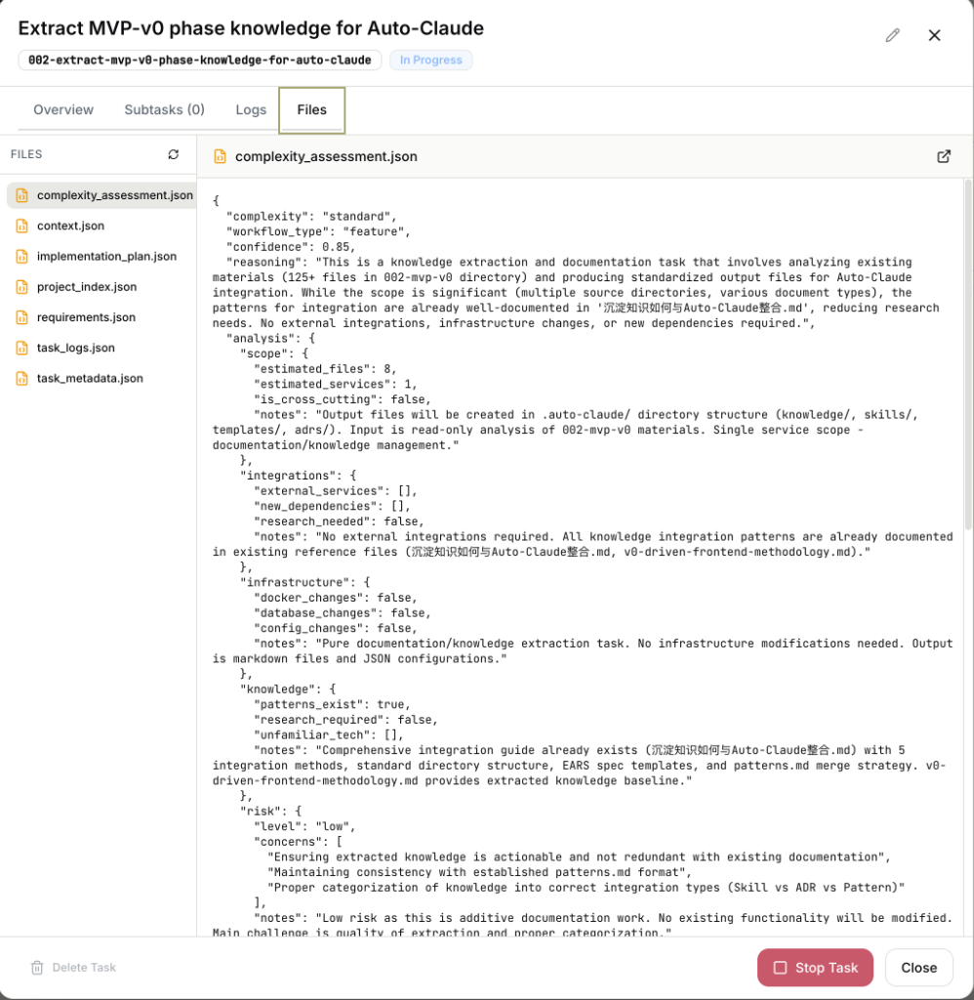

# 看板视图 (Kanban Board)

看板是 Auto-Claude 的核心工作区，用于管理任务生命周期。

---

## 界面概览



### 布局结构

| 区域 | 说明 |
|------|------|
| **左侧边栏** | 导航菜单（看板/代理终端/洞察/路线图等） |
| **顶部** | 项目选择器 + 显示已归档按钮 |
| **中央** | 5列任务看板 |
| **底部** | 设置入口 + 新建任务按钮 |

---

## 左侧边栏菜单

| 菜单项 | 图标 | 功能 |
|--------|------|------|
| **看板** | 📋 | 任务管理主界面（当前页） |
| **代理终端** | >_ | 查看 AI 执行过程 |
| **洞察** | 💡 | AI 对话和建议 |
| **路线图** | 🗺️ | 产品规划视图 |
| **创意** | ✨ | 创意收集 |
| **变更日志** | 📝 | 代码变更记录 |
| **上下文** | 📚 | 项目上下文管理 |
| **GitHub Issues** | 🐙 | 同步 GitHub Issues |
| **GitHub PRs** | 🔀 | 同步 Pull Requests |
| **工作树** | 🌳 | Git Worktree 管理 |
| **MCP 概览** | 🔌 | MCP 工具状态 |

---

## 任务看板 5 列

```
┌──────────┬──────────────┬────────────┬──────────────┬────────┐
│ Planning │ In Progress  │ AI Review  │ Human Review │  Done  │
│  规划中  │   进行中     │  AI 审查   │   人工审查   │  完成  │
├──────────┼──────────────┼────────────┼──────────────┼────────┤
│ 待处理   │  AI 正在     │  QA 验证   │  等待您      │ 已完成 │
│ 的任务   │  执行中      │  代码质量  │  审批合并    │ 可归档 │
└──────────┴──────────────┴────────────┴──────────────┴────────┘
```

### 各列说明

| 列 | 状态 | 颜色 | 用户操作 |
|----|------|------|----------|
| **Planning** | 待开始 | 无色 | 点击「开始」执行 |
| **In Progress** | AI 工作中 | 绿色渐变 | 观察或中断 |
| **AI Review** | QA 验证中 | 黄色渐变 | 等待 AI 完成 |
| **Human Review** | 需要批准 | 橙色渐变 | 审查并合并/拒绝 |
| **Done** | 已完成 | 灰色渐变 | 可归档或删除 |

---

## 任务卡片

每张任务卡片显示：

| 元素 | 说明 |
|------|------|
| **标题** | 任务描述的摘要（自动生成或手动输入） |
| **状态标签** | 如「待处理」等 |
| **描述预览** | 任务描述的前几行 |
| **时间** | 创建时间（如 "7m ago"） |
| **操作按钮** | 「开始」按钮启动任务 |

---

## 任务详情面板

点击任务卡片，右侧打开详情面板：



### 面板结构

| 区域 | 说明 |
|------|------|
| **顶部** | 任务标题 + 编辑按钮 |
| **任务 ID** | 唯一标识符（如 `002-extract-mvp-v0-phase-knowledge-for-auto-claude`） |
| **状态标签** | 当前阶段（如 `Planning`） |
| **标签页** | Overview / Subtasks / Logs |
| **来源标签** | `manual`（手动创建）或 `github`（从 Issue 导入） |
| **时间戳** | Created / Updated 时间 |
| **描述内容** | 完整的任务描述 |

### 标签页说明

| 标签 | 内容 |
|------|------|
| **Overview** | 任务描述和基本信息 |
| **Subtasks (0)** | AI 拆分的子任务列表 |
| **Logs** | 执行日志和历史记录 |
| **Files** | AI 生成的规格和配置文件（执行中出现） |

### 底部操作

| 按钮 | 功能 |
|------|------|
| **🗑️ Delete Task** | 删除任务 |
| **▶️ Start Task** | 开始执行任务 |
| **⏹️ Stop Task** | 停止正在执行的任务（红色） |
| **Close** | 关闭面板 |

---

## 任务执行中状态

当任务开始执行后，看板和详情面板会发生变化：

### 看板执行中视图



**任务卡片变化**：

| 元素 | 说明 |
|------|------|
| **状态标签** | 显示 `Planning` 或 `In Progress` |
| **进度条** | 橙色进度条显示当前阶段 |
| **阶段指示** | `规划` → `编码` → `QA` 三个阶段点 |
| **时间** | 显示 "just now" 等相对时间 |
| **停止按钮** | 红色「停止」按钮可中断任务 |

### Files 标签页（执行中专属）



任务执行过程中，AI 会生成多个 JSON 文件：

| 文件 | 内容 | 用途 |
|------|------|------|
| **complexity_assessment.json** | 复杂度评估 | AI 分析任务复杂度和风险 |
| **context.json** | 上下文信息 | 项目和任务的上下文数据 |
| **implementation_plan.json** | 实现计划 | 详细的实现步骤规划 |
| **project_index.json** | 项目索引 | 项目文件结构索引 |
| **requirements.json** | 需求列表 | 从描述提取的需求 |
| **task_logs.json** | 任务日志 | 执行过程日志 |
| **task_metadata.json** | 任务元数据 | 任务配置和状态 |

**complexity_assessment.json 示例内容**：

```json
{
  "complexity": "standard",
  "workflow_type": "feature",
  "confidence": 0.85,
  "reasoning": "This is a knowledge extraction task...",
  "analysis": {
    "scope": {
      "estimated_files": 8,
      "estimated_services": 1,
      "is_cross_cutting": false
    },
    "risk": {
      "level": "low",
      "concerns": [...]
    }
  }
}
```

---

## 任务状态流转

```
Planning → In Progress → AI Review → Human Review → Done
   ↑                        ↓
   └─────── QA 失败修复 ────┘
```

### 状态说明

| 状态 | 阶段 | 自动/手动 |
|------|------|-----------|
| **Planning** | 规格创建 + 实现规划 | 自动 |
| **In Progress** | 编码阶段 | 自动 |
| **AI Review** | QA 代码审查 | 自动 |
| **Human Review** | 等待人工审批 | 手动确认 |
| **Done** | 已完成合并 | 手动确认 |

---

## 顶部操作

| 按钮 | 功能 |
|------|------|
| **+ (Planning 列)** | 快速新建任务 |
| **显示已归档** | 查看已归档任务 |
| **⚙️ (右上)** | 项目设置 |

---

## 底部操作

| 按钮 | 功能 |
|------|------|
| **⚙️ 设置** | 打开应用设置 |
| **+ 新建任务** | 打开任务创建对话框 |

---

## 相关页面

- [任务创建](task-creation.md)
- [任务描述最佳实践](../04-best-practices/task-description-guide.md)
- [代理终端](agent-terminals.md)
- [核心概念：任务与 Worktree](../02-concepts/task-and-worktree.md)
