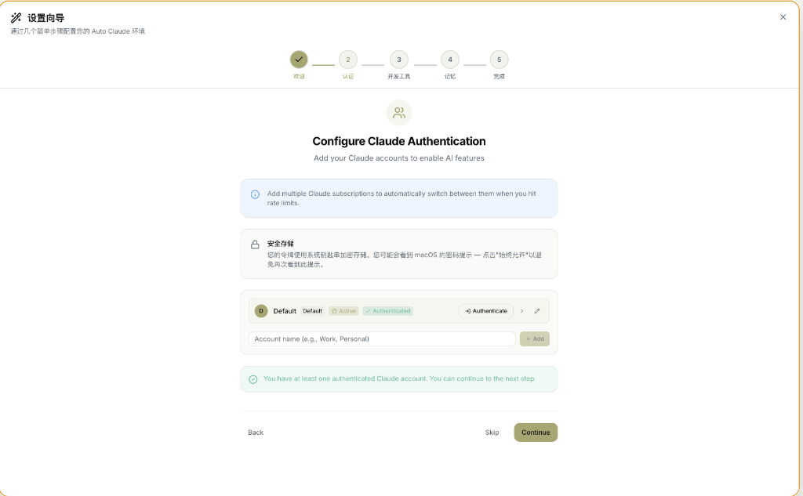
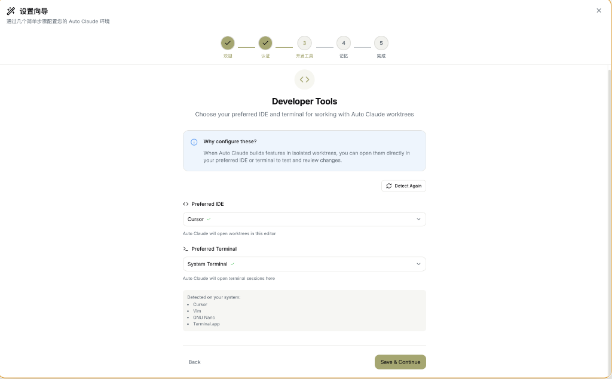
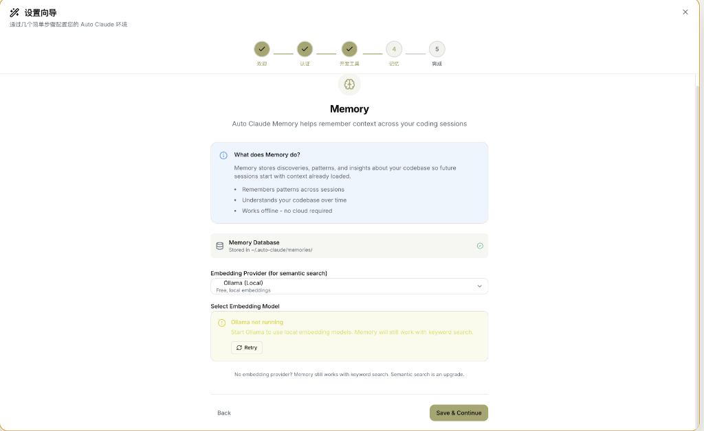
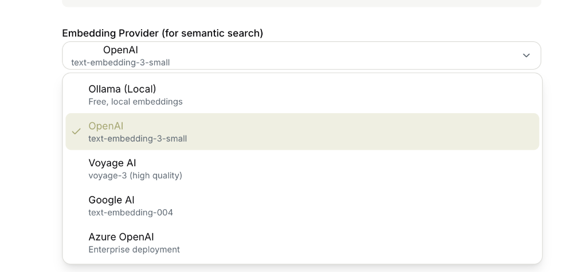

# 设置向导 (Onboarding Wizard)

Auto-Claude 的初始设置向导，帮助您配置核心功能。

---

## 向导概览

向导分为 5 个步骤：

```
✅ 欢迎 → 🔐 认证 → 🛠️ 开发工具 → 🧠 记忆 → ✨ 完成
```

---

## 第 1 步：欢迎

详见 [欢迎页面](welcome-screen.md)。

此步骤展示 Auto Claude 的四大核心功能，点击「开始使用」进入向导，或「跳过设置」直接进入主界面。

---

## 第 2 步：Claude 认证配置



### 页面说明

此步骤用于配置 Claude 账户认证，是使用 AI 功能的核心配置。

---

### 界面元素

#### 进度指示器

| 步骤 | 名称 | 状态 |
|------|------|------|
| 1 | 欢迎 | ✅ 完成 |
| **2** | **认证** | 🔵 当前 |
| 3 | 开发工具 | ⚪ 待完成 |
| 4 | 记忆 | ⚪ 待完成 |
| 5 | 完成 | ⚪ 待完成 |

---

### 配置区域

#### 💡 提示信息

> "添加多个 Claude 订阅，当达到速率限制时自动切换。"

这意味着您可以添加多个 Claude 账户，当一个账户达到使用限制时，Auto-Claude 会自动切换到另一个账户继续工作。

#### 🔒 安全存储

您的令牌使用 macOS 系统钥匙串加密存储。首次保存时可能会看到密码提示，点击"始终允许"以避免再次看到此提示。

---

### 账户列表

每个账户显示以下信息：

| 元素 | 说明 |
|------|------|
| **账户名称** | 自定义名称（如 Default、Work、Personal） |
| **Default 标签** | 系统默认账户 |
| **Active 标签** | 当前激活的账户 |
| **Authenticated 标签** | 绿色 ✅ 表示已认证 |
| **Needs Auth 标签** | 黄色表示需要认证 |

---

### 操作按钮

| 按钮 | 功能 |
|------|------|
| **Authenticate** | 启动 OAuth 认证流程 |
| **Set Active** | 设为当前使用的账户 |
| **>** | 展开手动输入令牌 |
| **✏️** | 重命名账户 |
| **🗑️** | 删除账户 |

---

### 添加新账户

在底部输入框输入账户名称（如 "Work"、"Personal"），点击 **+ Add** 添加新账户。

添加后会自动打开浏览器进行 OAuth 认证。

---

### 手动输入令牌

如果自动认证不可用，可以手动输入：

1. 在终端运行 `claude setup-token`
2. 复制获得的令牌
3. 点击账户右侧的 **>** 按钮
4. 粘贴令牌到输入框
5. 点击 **Save Token**

---

### 底部操作

| 按钮 | 功能 |
|------|------|
| **Back** | 返回上一步 |
| **Skip** | 跳过此步骤 |
| **Continue** | 进入下一步（至少需要 1 个已认证账户） |

---

### 成功状态

当至少有一个账户通过认证时，会显示绿色成功提示：

> "您至少有一个已认证的 Claude 账户。您可以继续下一步。"

---

## 第 3 步：开发工具配置



### 页面说明

此步骤用于配置您首选的 IDE 和终端工具。

---

### 为什么要配置？

> "当 Auto Claude 在隔离的工作区中构建功能时，您可以直接在首选的 IDE 或终端中打开它们以测试和审查更改。"

Auto Claude 使用 Git Worktree 在隔离环境中工作，配置开发工具后可以一键打开代码进行审查。

---

### 首选 IDE

选择您日常使用的代码编辑器：

| 选项 | 说明 |
|------|------|
| **Cursor** | AI 增强的代码编辑器（推荐） |
| **VS Code** | 微软 Visual Studio Code |
| **Vim** | 终端编辑器 |
| **GNU Nano** | 轻量终端编辑器 |
| **自定义** | 输入自定义 IDE 路径 |

---

### 首选终端

选择您习惯的终端应用：

| 选项 | 说明 |
|------|------|
| **System Terminal** | 系统默认终端 |
| **Terminal.app** | macOS 内置终端 |
| **iTerm** | 增强终端（如已安装） |
| **自定义** | 输入自定义终端路径 |

---

### 自动检测

Auto Claude 会自动检测您系统中已安装的工具：

```
检测到您的系统：
• Cursor
• Vim
• GNU Nano
• Terminal.app
```

点击 **Detect Again** 重新扫描。

---

### 操作按钮

| 按钮 | 功能 |
|------|------|
| **Back** | 返回认证配置 |
| **Save & Continue** | 保存设置并进入下一步 |

---

## 第 4 步：记忆配置



### 页面说明

配置 Auto Claude 的记忆系统，让 AI 在编码会话之间记住上下文。

---

### Memory 是什么？

> "Memory 存储发现、模式和关于代码库的洞察，使未来的会话从已加载的上下文开始。"

**核心功能：**
- 跨会话记住模式
- 随时间理解您的代码库
- 离线工作 — 无需云服务

---

### Memory Database

记忆数据存储在本地：

```
~/.auto-claude/memories/
```

状态指示：
- ✅ 绿色勾选 = 数据库已就绪

---

### Embedding Provider（嵌入提供商）

用于语义搜索的向量嵌入服务：



| 提供商 | 模型 | 说明 |
|--------|------|------|
| **Ollama (Local)** | 本地模型 | 免费，本地运行，推荐隐私敏感用户 |
| **OpenAI** | text-embedding-3-small | 高质量，需要 API Key |
| **Voyage AI** | voyage-3 | 高质量嵌入，专业选择 |
| **Google AI** | text-embedding-004 | Gemini 嵌入模型 |
| **Azure OpenAI** | Enterprise deployment | 企业级部署 |

> 💡 **推荐**: 如果有 OpenAI API Key，选择 **OpenAI** 的 `text-embedding-3-small` 模型，性价比最高。

---

### 选择嵌入模型

如果使用 Ollama，需要先启动 Ollama 服务：

```bash
ollama serve
```

如果 Ollama 未运行，会显示黄色警告：
> "Ollama not running. Start Ollama to use local embedding models. Memory will still work with keyword search."

点击 **Retry** 重新检测。

---

### 没有嵌入提供商？

> "No embedding provider? Memory still works with keyword search. Semantic search is an upgrade."

即使不配置嵌入，Memory 仍然可以使用关键词搜索工作。语义搜索是可选的增强功能。

---

### 操作按钮

| 按钮 | 功能 |
|------|------|
| **Back** | 返回开发工具配置 |
| **Save & Continue** | 保存设置并进入完成页 |

---

## 第 5 步：设置完成


### 页面说明

恭喜！您已完成 Auto-Claude 的初始配置。

---

### 设置完成状态

绿色提示框显示：

> "您的环境已配置并准备就绪。您可以立即开始创建任务或按自己的节奏探索应用。"

---

### 下一步？

向导提供三个快捷入口：

| 入口 | 说明 | 操作 |
|------|------|------|
| **📋 创建任务** | 从创建第一个任务开始，体验 Auto Claude 的强大功能 | 点击"打开任务创建器" |
| **⚙️ 自定义设置** | 调整偏好设置、配置集成或重新运行此向导 | 点击"打开设置" |
| **📚 探索文档** | 了解更多高级功能、最佳实践和故障排除 | 查看在线文档 |

---

### 完成按钮

点击 **✨ 完成并开始构建** 按钮进入主界面。

---

### 重新运行向导

底部提示：

> "您可以随时从 设置 → 应用 重新运行此向导"

---

## 向导总结

| 步骤 | 内容 | 必要性 |
|------|------|--------|
| 1. 欢迎 | 了解功能 | — |
| 2. 认证 | 配置 Claude 账户 | **必需** |
| 3. 开发工具 | 选择 IDE/终端 | 可选 |
| 4. 记忆 | 配置 Memory 系统 | 可选 |
| 5. 完成 | 进入主界面 | — |

---

## 相关页面

- [欢迎页面](welcome-screen.md)
- [设置页面](settings.md)
- [看板视图](kanban-board.md)
