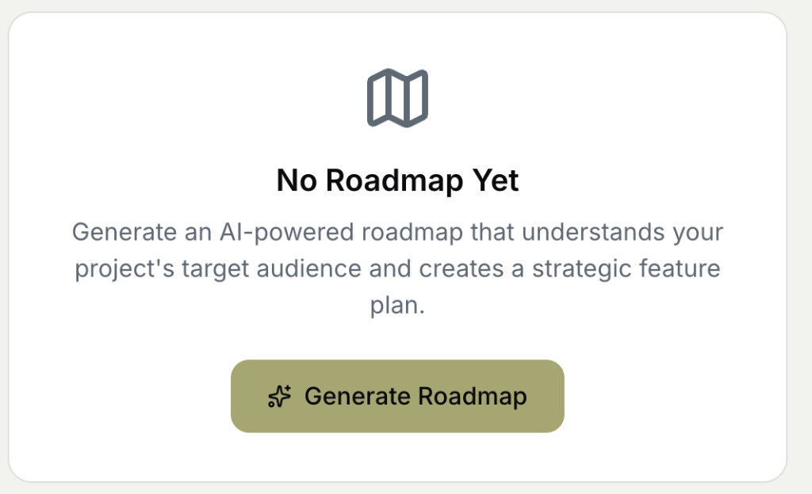
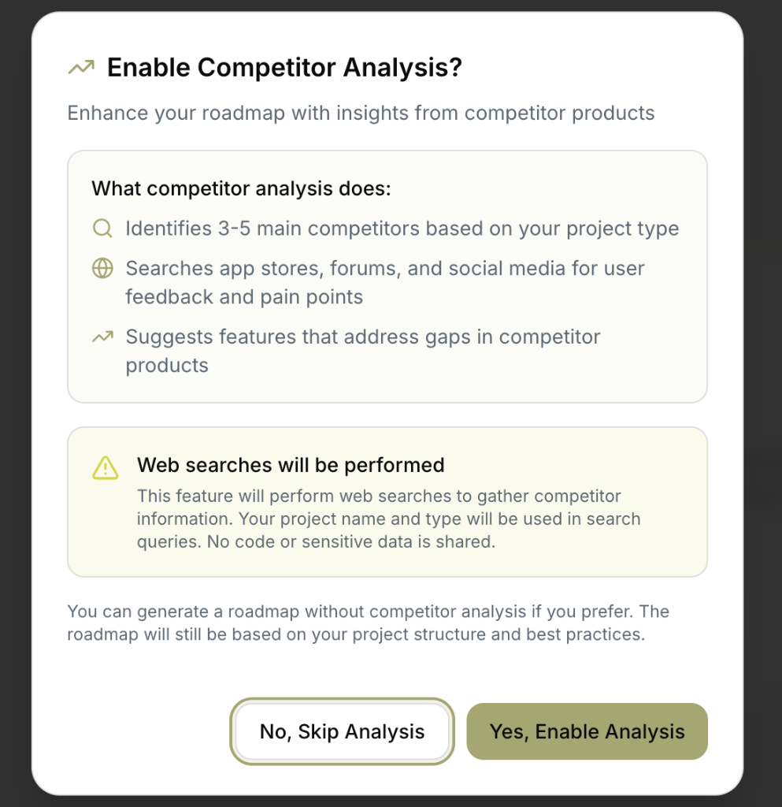
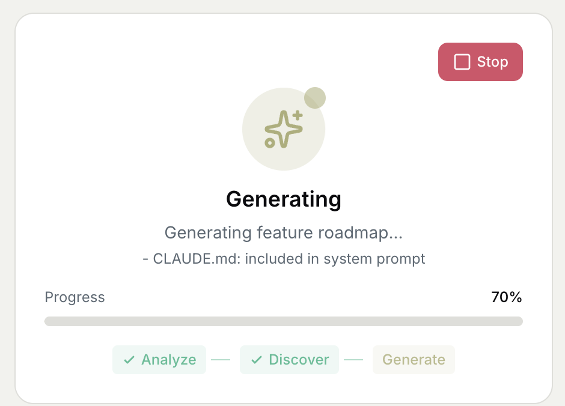

# 路线图 (Roadmap)

AI 驱动的产品路线图生成器，帮助您规划项目功能。

---

## 功能概述

路线图功能可以：

- 🤖 **AI 自动生成**：分析项目结构，生成战略功能计划
- 🔍 **竞争对手分析**：搜索市场信息，发现竞品差距
- 📋 **功能管理**：按阶段组织功能，转换为开发任务
- 📊 **可视化展示**：看板/时间轴双视图

---

## 空状态

首次进入路线图页面时显示空状态：

### 界面说明

> "No Roadmap Yet"
> 
> "Generate an AI-powered roadmap that understands your project's target audience and creates a strategic feature plan."
>
> **翻译**：尚无路线图。生成一个 AI 驱动的路线图，它能理解您项目的目标受众并创建战略功能计划。

点击 **✨ Generate Roadmap** 开始生成。

---

## 竞争对手分析选项

点击生成后会询问是否启用竞争对手分析：

### 功能说明

> "Enable Competitor Analysis?"
>
> "Enhance your roadmap with insights from competitor products"
>
> **翻译**：是否启用竞争对手分析？通过竞品洞察增强您的路线图。

### 竞争对手分析做什么？

| 功能 | 说明 |
|------|------|
| **识别竞品** | 根据项目类型识别 3-5 个主要竞争对手 |
| **搜索反馈** | 搜索应用商店、论坛、社交媒体获取用户反馈和痛点 |
| **建议功能** | 建议可填补竞品空缺的功能 |

### ⚠️ 注意事项

> "Web searches will be performed"
>
> "This feature will perform web searches to gather competitor information. Your project name and type will be used in search queries. No code or sensitive data is shared."
>
> **翻译**：此功能将进行网络搜索以收集竞争对手信息。您的项目名称和类型将用于搜索查询。不会共享任何代码或敏感数据。

### 选项按钮

| 按钮 | 作用 |
|------|------|
| **No, Skip Analysis** | 跳过竞争分析，仅基于项目结构生成 |
| **Yes, Enable Analysis** | 启用竞争分析，获取更丰富的功能建议 |

---

## 生成中状态

选择后开始生成路线图：

### 界面说明

**标题**：Generating

**进度信息**：
- "Generating feature roadmap..."
- "CLAUDE.md: included in system prompt"（说明 AI 读取了项目的 CLAUDE.md）

### 生成阶段

| 阶段 | 说明 | 状态 |
|------|------|------|
| **Analyze** | 分析项目结构 | ✅ 完成 |
| **Discover** | 发现功能机会 | ✅ 完成 |
| **Generate** | 生成路线图 | 🔄 进行中 |

**进度条**：显示当前进度百分比（如 70%）

**停止按钮**：红色「Stop」按钮可中断生成

---

## 生成完成后

生成完成后进入主路线图视图：

### 主界面结构

| 区域 | 说明 |
|------|------|
| **顶部** | 路线图标题 + 刷新/添加功能按钮 |
| **标签页** | Kanban（看板）/ Timeline（时间轴） |
| **内容区** | 按阶段组织的功能列表 |
| **详情面板** | 点击功能查看详情 |

### 功能卡片

每个功能显示：
- 功能名称和描述
- 优先级标签（High/Medium/Low）
- 复杂度估算
- 转换为任务按钮

### 功能操作

| 操作 | 说明 |
|------|------|
| **Convert to Spec** | 将功能转换为开发任务 |
| **Go to Task** | 跳转到对应任务 |
| **Delete** | 删除功能 |
| **Edit** | 编辑功能详情 |

---

## 竞争对手分析查看器

如果启用了竞争分析，可以查看分析结果：

| 内容 | 说明 |
|------|------|
| **竞品列表** | 识别的主要竞争对手 |
| **用户反馈** | 从社交媒体收集的用户意见 |
| **痛点分析** | 竞品用户的常见问题 |
| **功能建议** | 基于分析的功能推荐 |

---

## 添加功能对话框

手动添加新功能到路线图：

| 字段 | 说明 |
|------|------|
| **名称** | 功能名称 |
| **描述** | 功能详细描述 |
| **阶段** | 选择所属阶段（如 MVP/Growth 等） |
| **优先级** | High/Medium/Low |
| **复杂度** | 1-5 估算 |

---

## 源码参考

路线图功能由以下组件实现：

| 组件 | 路径 | 功能 |
|------|------|------|
| `Roadmap.tsx` | `renderer/components/` | 主组件 |
| `RoadmapEmptyState.tsx` | `renderer/components/roadmap/` | 空状态 |
| `RoadmapGenerationProgress.tsx` | `renderer/components/` | 生成进度 |
| `RoadmapKanbanView.tsx` | `renderer/components/` | 看板视图 |
| `RoadmapHeader.tsx` | `renderer/components/roadmap/` | 顶部标题 |
| `RoadmapTabs.tsx` | `renderer/components/roadmap/` | 标签页 |
| `CompetitorAnalysisDialog.tsx` | `renderer/components/` | 竞争分析对话框 |

---

## 相关页面

- [看板视图](kanban-board.md)
- [任务创建](task-creation.md)
- [任务描述最佳实践](../04-best-practices/task-description-guide.md)
