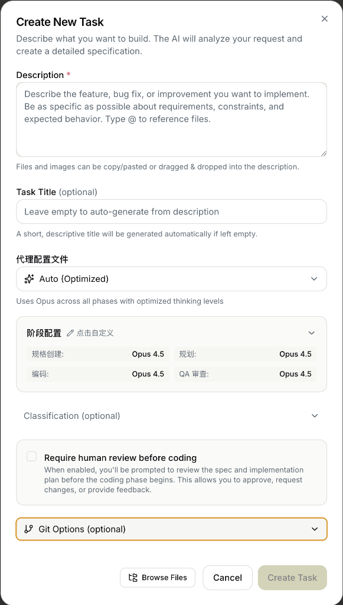
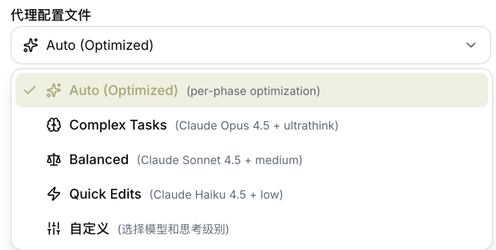
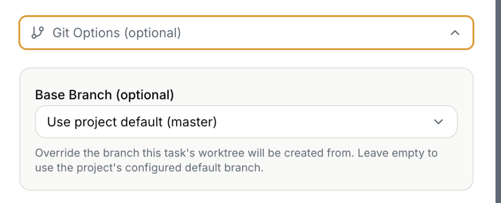

# 任务创建 (Create Task)

Auto-Claude 的核心功能 — 创建并执行 AI 开发任务。

---

## 入口

从向导完成页或主界面看板，点击「**创建任务**」进入任务创建对话框。


---

## 任务创建对话框



### 界面概览

| 区域 | 说明 |
|------|------|
| **Description** | 任务描述（必填） |
| **Task Title** | 任务标题（可选，自动生成） |
| **代理配置文件** | AI 模型和思考级别 |
| **阶段配置** | 各阶段模型设置 |
| **Classification** | 任务分类（可选） |
| **Human Review** | 编码前人工审查 |
| **Git Options** | 分支配置 |

---

## 字段详解

### 1. Description（描述）⭐ 必填

```
描述您想要实现的功能、Bug 修复或改进。
尽可能具体说明需求、约束和预期行为。
输入 @ 可引用文件。
```

**支持功能：**
- 📸 **粘贴截图** — Ctrl+V 直接粘贴
- 📂 **拖拽文件** — 图片或文件引用
- 📝 **@ 引用** — 输入 `@` 搜索项目文件

---

### 2. Task Title（任务标题）可选

留空会自动根据描述生成简短标题。

---

### 3. 代理配置文件 (Agent Profile)



选择 AI 执行任务的模式（详见 [配置选项深度解析](#配置选项深度解析)）：

| 配置 | 适用场景 |
|------|----------|
| **✨ Auto (Optimized)** | 推荐，智能分配资源 |
| **🧠 Complex Tasks** | 复杂架构设计 |
| **⚖️ Balanced** | 常规开发任务 |
| **⚡ Quick Edits** | 简单修复 |
| **🛠️ 自定义** | 高级用户 |

---

### 4. 阶段配置（Auto 模式专属）

Auto 模式下可自定义各阶段（规格创建/规划/编码/QA审查）使用的模型。

点击「点击自定义」展开配置面板，详见 [阶段配置详解](#阶段配置详解-auto-模式)。

---

### 5. Classification（分类）可选

展开后可设置任务元数据：

| 字段 | 选项 |
|------|------|
| **Category** | Feature / Bug / Refactor / Docs 等 |
| **Priority** | Low / Medium / High / Critical |
| **Complexity** | Simple / Medium / Complex / Epic |
| **Impact** | Low / Medium / High |

---

### 6. Require Human Review Before Coding

勾选后启用人工审查：

> "启用后，在编码阶段开始前，系统会提示您审查规格和实现计划。
> 这允许您批准、请求更改或提供反馈。"

**工作流程：**
```
规格创建 → 规划 → ⏸️ 人工审查 → 编码 → QA 审查
```

---

### 7. Git Options（Git 选项）



#### Base Branch（基础分支）

| 选项 | 说明 |
|------|------|
| **Use project default** | 使用项目配置的默认分支（如 master/main） |
| **指定分支** | 从下拉列表选择其他分支 |

> "覆盖此任务工作区创建时使用的分支。留空则使用项目配置的默认分支。"

---

## 底部操作

| 按钮 | 功能 |
|------|------|
| **📂 Browse Files** | 打开文件浏览器添加引用 |
| **Cancel** | 取消创建（自动保存草稿） |
| **Create Task** | 创建任务开始执行 |

---

## 高级功能

### 草稿自动保存

关闭对话框时，未完成的内容会自动保存为草稿。
重新打开时显示「Draft restored」提示，可点击「Start Fresh」清除。

### 图片附件

- 最多 **5 张** 图片
- 支持 PNG、JPG、GIF、WebP
- 可粘贴截图或拖拽文件

### 文件引用

输入 `@` 触发文件自动补全，选择项目中的文件引用到描述中。

---

## 任务创建后

创建成功后任务进入看板的 **Backlog** 列，系统会：

1. 自动创建 Git Worktree（隔离工作环境）
2. 开始执行规格创建阶段
3. 在代理终端显示执行进度

---

## 配置选项深度解析

### 代理配置文件实际作用

| 配置 | 模型 | 思考级别 | 实际作用 |
|------|------|----------|----------|
| **✨ Auto (Optimized)** | 分阶段自动选择 | 分阶段自动 | **推荐**：系统根据每个阶段的需求自动分配最合适的模型。规格创建用 Opus（需要深度理解），编码可能用 Sonnet（速度+质量平衡） |
| **🧠 Complex Tasks** | Claude Opus 4.5 | ultrathink | 全程使用最强模型+最深思考。适合：复杂架构设计、跨多模块重构、需要深度推理的任务。**消耗 Token 最多，速度最慢** |
| **⚖️ Balanced** | Claude Sonnet 4.5 | medium | 全程使用中等模型+中等思考。适合：日常功能开发、Bug 修复、一般复杂度任务。**性价比最高** |
| **⚡ Quick Edits** | Claude Haiku 4.5 | low | 全程使用最快模型+最少思考。适合：简单文本修改、格式调整、小修小补。**速度最快，成本最低** |
| **🛠️ 自定义** | 手动选择 | 手动选择 | 完全手动控制模型和思考级别的组合 |

---

### 阶段配置详解 (Auto 模式)

| 阶段 | 作用 | 默认模型 | 为什么这样配置 |
|------|------|----------|----------------|
| **规格创建** | 分析任务需求，生成详细规格文档 | Opus 4.5 | 需要深度理解需求，确保规格准确 |
| **规划** | 根据规格制定实现计划，拆分子任务 | Opus 4.5 | 需要全局视角规划架构 |
| **编码** | 实际编写代码、创建/修改文件 | Opus 4.5 | 需要精确执行和代码质量 |
| **QA 审查** | 代码审查、运行测试、验证正确性 | Opus 4.5 | 需要发现潜在问题 |

---

### 分类元数据用途

| 字段 | 选项 | 实际用途 |
|------|------|----------|
| **Category** | Feature / Bug / Refactor / Docs / Chore / Test | 用于看板筛选和统计 |
| **Priority** | Low / Medium / High / Critical | 影响任务排序和视觉标识 |
| **Complexity** | Simple / Medium / Complex / Epic | 帮助 AI 调整工作策略 |
| **Impact** | Low / Medium / High | 记录业务影响程度 |

---

### Human Review 工作流对比

| 状态 | 工作流 |
|------|--------|
| **❌ 未勾选** | `规格创建 → 规划 → 编码 → QA审查`（全自动） |
| **✅ 勾选** | `规格创建 → 规划 → ⏸️ 暂停等您审批 → 编码 → QA审查` |

**勾选的好处**：
- 在 AI 开始写代码前检查它理解是否正确
- 可以修改规格或计划
- 适合重要功能或不确定需求时使用

---

### Git Base Branch 作用

| 选项 | 实际效果 |
|------|----------|
| **Use project default** | 从项目的主分支创建 worktree |
| **指定其他分支** | 从指定分支创建 worktree（如 develop、feature-xxx） |

**为什么重要**：Auto-Claude 为每个任务创建独立的 Git Worktree，Base Branch 决定了代码的起点。

---

## 实际使用建议

| 场景 | 推荐配置 |
|------|----------|
| 日常开发 | Auto (Optimized) + 不勾选 Human Review |
| 重要功能 | Auto (Optimized) + ✅ 勾选 Human Review |
| 快速修复 typo | Quick Edits |
| 大型重构 | Complex Tasks + ✅ 勾选 Human Review |
| 学习/测试 | Balanced |

---

## 相关页面

- [核心概念：任务与 Worktree](../02-concepts/task-and-worktree.md)
- [看板视图](kanban-board.md)
- [代理终端](agent-terminals.md)
- [设置向导](onboarding-wizard.md)
