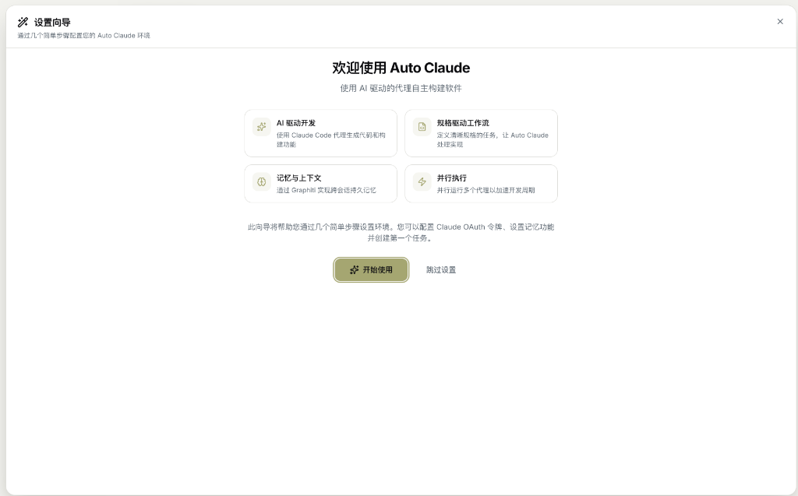

# 欢迎页面 (Welcome Screen)

首次启动 Auto-Claude 或打开新项目时看到的首个界面。

---

## 界面预览



---

## 界面元素详解

### 设置向导对话框

首次使用时会显示设置向导，帮助您完成初始配置。

#### 标题栏

| 元素 | 说明 |
|------|------|
| 🔧 设置向导 | 向导标题 |
| × 关闭按钮 | 点击跳过设置向导 |

#### 欢迎区域

**主标题**: "欢迎使用 Auto Claude"

**副标题**: "使用 AI 驱动的代理自主构建软件"

---

### 四大核心功能

Auto Claude 的核心能力以卡片形式展示：

| 功能 | 图标 | 说明 |
|------|------|------|
| **AI 驱动开发** | ✨ | 使用 Claude Code 代理生成代码和构建功能 |
| **规格驱动工作流** | 📄 | 定义清晰规格的任务，让 Auto Claude 处理实现 |
| **记忆与上下文** | 🧠 | 通过 Graphiti 实现跨会话持久记忆 |
| **并行执行** | ⚡ | 并行运行多个代理以加速开发周期 |

---

### 操作按钮

| 按钮 | 功能 | 触发行为 |
|------|------|----------|
| **✨ 开始使用** | 启动设置向导 | 进入认证配置步骤 |
| **跳过设置** | 跳过向导 | 直接进入主界面 |

---

## 设置向导完整流程

点击"开始使用"后，将按以下步骤配置：

```
1. 欢迎 → 2. 认证 → 3. 开发工具 → 4. 记忆 → 5. 完成
```

### 步骤详解

| 步骤 | 内容 | 可选 |
|------|------|------|
| **认证** | 配置 Claude OAuth Token | ✅ 推荐 |
| **开发工具** | 选择首选 IDE 和终端 | 可选 |
| **记忆** | 配置 Graphiti 记忆后端 | 可选 |
| **完成** | 设置完成确认 | - |

---

## 技术详情

### 组件结构

```
onboarding/
├── OnboardingWizard.tsx   # 向导主容器
├── WelcomeStep.tsx        # 欢迎步骤
├── OAuthStep.tsx          # OAuth 认证
├── DevToolsStep.tsx       # 开发工具配置
├── MemoryStep.tsx         # 记忆配置
├── GraphitiStep.tsx       # Graphiti 详细设置
└── CompletionStep.tsx     # 完成步骤
```

### 国际化

欢迎页面完全支持多语言，翻译文件位于：
- `locales/en/onboarding.json`
- `locales/zh/onboarding.json`
- `locales/fr/onboarding.json`

---

## 相关页面

- [快速入门](../01-quick-start.md)
- [设置页面](settings.md)
- [看板视图](kanban-board.md)
