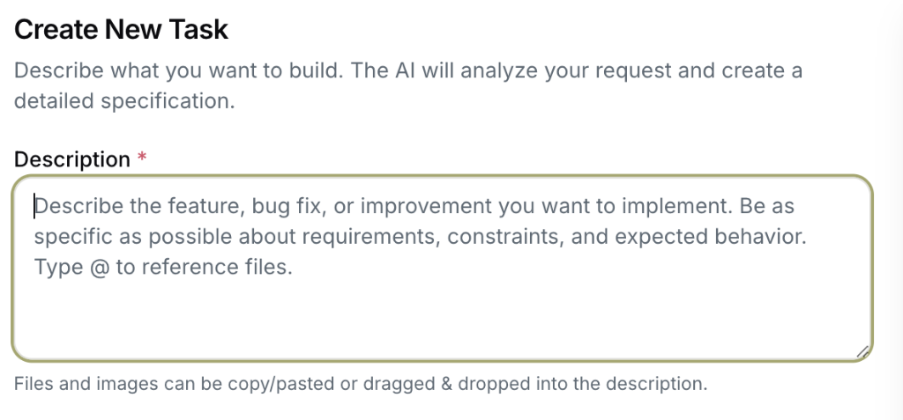

# 任务描述最佳实践

如何编写高质量的任务描述，让 AI 更好地理解和执行您的需求。

---

## 系统提示解读



系统对任务描述的官方提示：

> "Describe the feature, bug fix, or improvement you want to implement. 
> Be as specific as possible about requirements, constraints, and expected behavior. 
> Type @ to reference files."

**翻译**：描述您想要实现的功能、Bug 修复或改进。尽可能具体说明需求、约束和预期行为。输入 @ 引用文件。

---

## 任务描述的核心要素

### 必须包含

| 要素 | 说明 | 示例 |
|------|------|------|
| **目标** | 你想要什么结果 | "添加用户登录功能" |
| **背景** | 为什么需要这个 | "目前用户只能匿名访问" |
| **范围** | 涉及哪些部分 | "只做后端 API，不改前端" |

### 强烈建议包含

| 要素 | 说明 | 示例 |
|------|------|------|
| **约束** | 技术/业务限制 | "必须使用 JWT，不能用 Session" |
| **预期行为** | 完成后应该怎样 | "登录失败显示错误提示" |
| **文件引用** | 相关代码位置 | "@src/auth/login.ts" |
| **验收标准** | 如何判断完成 | "所有测试通过，支持 OAuth" |

---

## 好的描述 vs 差的描述

### ❌ 差的描述

```
添加登录功能
```

**问题**：太模糊，AI 不知道：
- 用什么技术？
- 支持哪些登录方式？
- 数据存在哪里？

### ✅ 好的描述

```
为项目添加用户登录功能：

**背景**：
目前系统没有用户认证，所有人可以访问所有功能。

**需求**：
1. 支持邮箱+密码登录
2. 使用 JWT 进行会话管理
3. Token 有效期 7 天

**约束**：
- 使用项目现有的 @src/database/prisma.ts
- 密码必须 bcrypt 加密
- 不需要注册功能，用户由管理员创建

**验收标准**：
- POST /api/auth/login 返回 JWT
- 无效凭证返回 401
- 现有测试不受影响
```

---

## 使用 @ 引用文件

输入 `@` 会触发文件搜索，选择项目中的文件：

```
请修复 @src/components/Button.tsx 中的样式问题，
参考 @src/styles/theme.css 中的颜色变量。
```

**好处**：
- AI 会自动读取这些文件的内容
- 确保 AI 理解现有代码结构
- 减少 AI 的猜测和错误

---

## 准备材料配合使用

### 开始前准备

| 材料类型 | 说明 | 如何准备 |
|----------|------|----------|
| **需求文档** | PRD/用户故事 | 复制关键段落到描述 |
| **设计稿** | UI 截图 | 直接粘贴到描述框 |
| **API 文档** | 接口规范 | 引用文件或贴链接 |
| **参考代码** | 类似实现 | 使用 @ 引用文件 |
| **错误日志** | Bug 复现 | 粘贴错误堆栈 |

### 项目准备

```
✅ 推荐的项目结构：

project/
├── README.md          ← 项目说明，AI 会读取
├── .specs/            ← 规格文档目录
│   └── feature-xxx/   ← 功能规格
├── docs/              ← 文档目录
│   └── architecture.md ← 架构说明
└── src/               ← 源代码
```

### 最佳实践

1. **保持 README.md 更新** — AI 首先阅读这个文件理解项目
2. **使用 @CLAUDE.md** — 项目根目录放置 AI 专用说明
3. **清晰的目录结构** — 便于 AI 定位相关文件
4. **写好注释** — 帮助 AI 理解代码意图

---

## 不同场景的描述模板

### 新功能开发

```
**功能名称**：[名称]

**背景**：
[为什么需要这个功能]

**需求**：
1. [需求1]
2. [需求2]
3. [需求3]

**相关文件**：
- @path/to/related/file.ts
- @path/to/another/file.ts

**验收标准**：
- [标准1]
- [标准2]
```

### Bug 修复

```
**问题描述**：
[具体的错误表现]

**复现步骤**：
1. [步骤1]
2. [步骤2]
3. [出现错误]

**期望行为**：
[正确的结果应该是什么]

**错误日志**：
```
[错误堆栈]
```

**可能相关文件**：
@path/to/file.ts
```

### 重构任务

```
**重构目标**：
[要改进什么]

**当前问题**：
- [问题1]
- [问题2]

**期望结果**：
- [改进1]
- [改进2]

**约束**：
- 不改变对外 API
- 保持测试通过

**涉及文件**：
@src/module/
```

---

## 相关页面

- [任务创建](task-creation.md)
- [看板视图](kanban-board.md)
- [核心概念：任务与 Worktree](../02-concepts/task-and-worktree.md)
