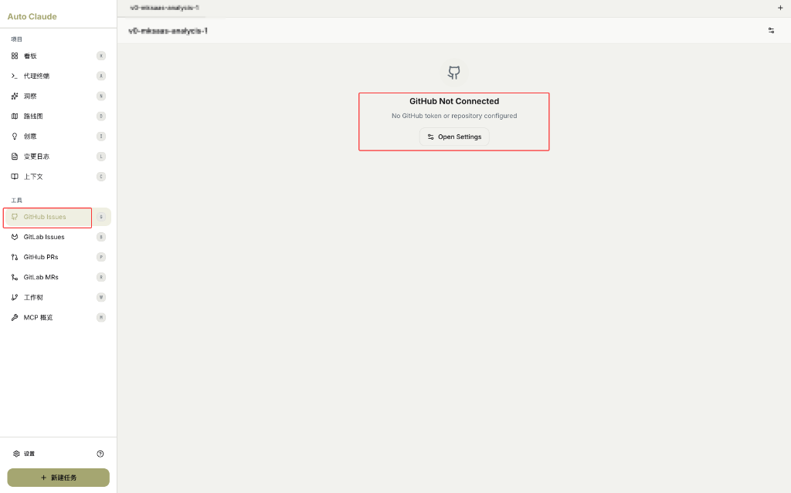
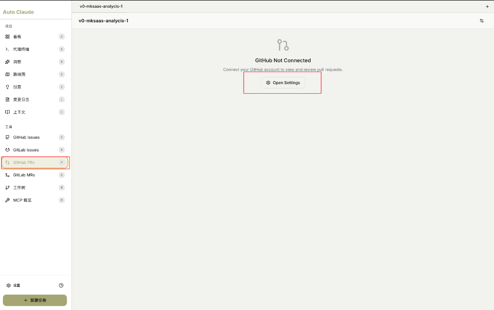
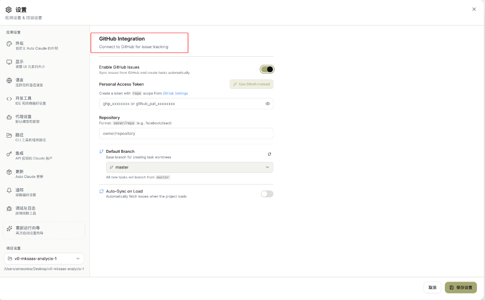

# GitHub 集成

将 Auto-Claude 与 GitHub 连接，实现 Issue 同步和 PR 管理。

---

## 功能概述

GitHub 集成提供：

- 📋 **Issues 同步**：将 GitHub Issues 导入为任务
- 🔀 **PRs 管理**：查看和审查 Pull Requests
- 🔄 **自动同步**：项目加载时自动获取最新 Issues
- 🏷️ **任务创建**：Issue 自动转换为 Auto-Claude 任务

---

## Issues 和 PR 是什么？

### 简单比喻

| 概念 | 比喻 | 角色 |
|------|------|------|
| **Issue** | 📝 待办事项清单 | "我们需要做这件事" |
| **PR** | 📦 完成的工作交付 | "我做完了，请审查" |

### 详细对比

| 方面 | Issue | Pull Request (PR) |
|------|-------|-------------------|
| **是什么** | 问题/需求/Bug 报告 | 代码变更请求 |
| **作用** | 记录"要做什么" | 提交"做了什么" |
| **发起时机** | 发现问题或提需求时 | 代码写完准备合并时 |
| **包含内容** | 描述、标签、指派人 | 代码变更、对比、审查 |
| **状态** | Open → Closed | Open → Merged/Closed |
| **关联代码** | ❌ 不直接包含代码 | ✅ 包含代码变更 |

### 工作流程

```
1. 用户报告 Bug
        │
        ▼
   ┌─────────────────┐
   │  创建 Issue     │  ← "登录按钮点击无响应"
   │  Issue #123     │
   └─────────────────┘
        │
        ▼
2. 开发者修复代码
        │
        ▼
   ┌─────────────────┐
   │  创建 PR        │  ← "Fix: 修复登录按钮事件绑定"
   │  PR #456        │     关联 Issue #123
   └─────────────────┘
        │
        ▼
3. 代码审查 → 合并 PR → Issue 自动关闭
```

### 在 Auto-Claude 中的用途

| 功能 | Issue | PR |
|------|-------|-----|
| **导入为任务** | ✅ 将 Issue 转为 AI 任务 | ❌ 不导入 |
| **AI 处理** | AI 读取 Issue 理解需求 | AI 可辅助审查 |
| **输出结果** | AI 完成后可创建 PR | 审查和合并 |

> **一句话总结**：Issue = 需求/问题（要做什么），PR = 解决方案（做完了什么）

---

## GitHub Issues

### 未连接状态



> "GitHub Not Connected"
>
> "No GitHub token or repository configured"
>
> **翻译**：GitHub 未连接。未配置 GitHub 令牌或仓库。

点击 **Open Settings** 进入设置页面配置。

### 连接后功能

| 功能 | 说明 |
|------|------|
| **同步 Issues** | 从 GitHub 拉取 Issues 列表 |
| **导入为任务** | 将 Issue 转换为 Auto-Claude 任务 |
| **状态同步** | 任务完成后更新 Issue 状态 |
| **标签筛选** | 按标签过滤 Issues |

---

## GitHub PRs

### 未连接状态



> "GitHub Not Connected"
>
> "Connect your GitHub account to view and review pull requests."
>
> **翻译**：GitHub 未连接。连接您的 GitHub 账户以查看和审查 Pull Requests。

点击 **Open Settings** 进入设置页面配置。

### 连接后功能

| 功能 | 说明 |
|------|------|
| **查看 PRs** | 列出仓库的 Pull Requests |
| **AI 审查** | 使用 AI 辅助代码审查 |
| **合并管理** | 审批和合并 PR |

---

## GitHub 设置详解



### 界面说明

> "GitHub Integration"
>
> "Connect to GitHub for issue tracking"
>
> **翻译**：GitHub 集成 - 连接 GitHub 进行 Issue 跟踪

### 配置选项

| 字段 | 说明 | 示例值 |
|------|------|--------|
| **Enable GitHub Issues** | 启用 GitHub Issues 同步 | ✅ 开启 |
| **Personal Access Token** | GitHub 个人访问令牌 | `ghp_xxxxxxxx` 或 `github_pat_xxxxxxxx` |
| **Repository** | 仓库地址 | `owner/repository` |
| **Default Branch** | 默认分支 | `master` |
| **Auto-Sync on Load** | 加载时自动同步 | ❌ 关闭 |

---

## 各配置项详解

### Enable GitHub Issues（启用 GitHub Issues）

> "Sync issues from GitHub and create tasks automatically"
>
> **翻译**：从 GitHub 同步 Issues 并自动创建任务

**作用**：开启后，可以在 GitHub Issues 页面看到仓库的 Issues。

---

### Personal Access Token（个人访问令牌）

> "Create a token with `repo` scope from [GitHub Settings](https://github.com/settings/tokens)"
>
> **翻译**：从 GitHub 设置创建一个具有 `repo` 权限的令牌

**两种认证方式**：

| 方式 | 说明 |
|------|------|
| **Personal Access Token** | 手动输入令牌（经典方式） |
| **Use OAuth Instead** | 使用 OAuth 浏览器登录（推荐） |

#### 如何获取 Token

1. 打开 [GitHub Settings → Tokens](https://github.com/settings/tokens)
2. 点击 **Generate new token (classic)**
3. 选择 `repo` 权限范围
4. 复制生成的令牌
5. 粘贴到 Personal Access Token 字段

**令牌格式**：
- 经典令牌：`ghp_xxxxxxxxxxxxxxxxxxxx`
- 细粒度令牌：`github_pat_xxxxxxxxxxxxxxxxxxxx`

---

### Repository（仓库）

> "Format: owner/repo (e.g., facebook/react)"
>
> **翻译**：格式：owner/repo（例如 facebook/react）

**示例**：
- `ameureka/Auto-Claude`
- `facebook/react`
- `vercel/next.js`

---

### Default Branch（默认分支）

> "Base branch for creating task worktrees"
>
> "All new tasks will branch from [master]"
>
> **翻译**：创建任务工作区的基础分支。所有新任务将从 [master] 分支。

**常见选项**：
- `master`
- `main`
- `develop`

点击刷新按钮 🔄 可重新获取分支列表。

---

### Auto-Sync on Load（加载时自动同步）

> "Automatically fetch issues when the project loads"
>
> **翻译**：项目加载时自动获取 Issues

**作用**：开启后，打开项目时自动拉取最新 Issues。

---

## 配置步骤

### 方式一：使用 Token

1. 打开设置 → GitHub
2. 开启 **Enable GitHub Issues**
3. 从 GitHub 获取 Personal Access Token
4. 填写 **Repository**（如 `owner/repo`）
5. 选择 **Default Branch**
6. 点击「保存设置」

### 方式二：使用 OAuth

1. 打开设置 → GitHub
2. 开启 **Enable GitHub Issues**
3. 点击 **Use OAuth Instead** 按钮
4. 在浏览器中授权 GitHub 访问
5. 填写 **Repository**
6. 选择 **Default Branch**
7. 点击「保存设置」

---

## 使用场景

| 场景 | 操作 |
|------|------|
| **处理 Bug** | GitHub Issues → 导入任务 → AI 修复 |
| **新功能** | 创建 Issue → 同步 → 开发 → PR |
| **代码审查** | GitHub PRs → AI 辅助审查 |

---

## 相关页面

- [看板视图](kanban-board.md)
- [任务创建](task-creation.md)
- [GitLab 集成](gitlab-integration.md)
