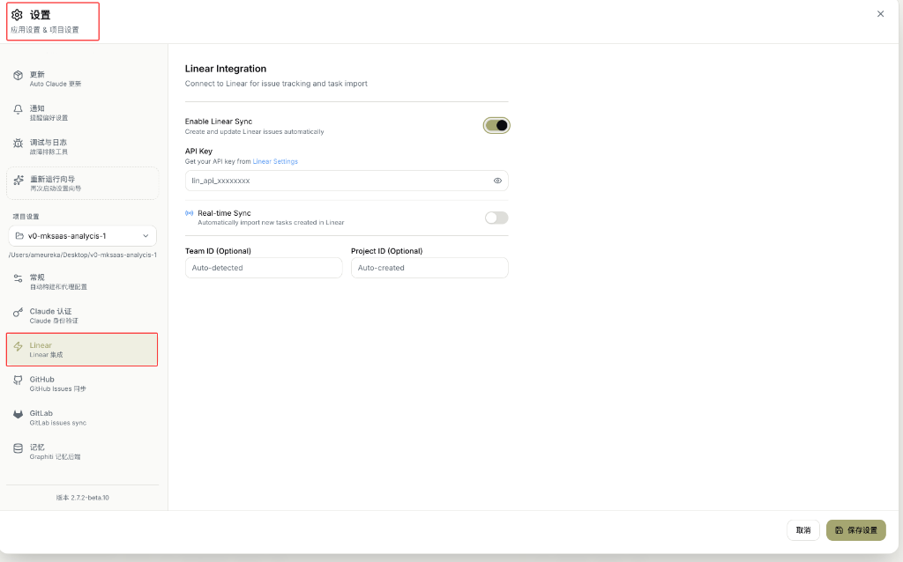

# Linear 集成

将 Auto-Claude 与 Linear 连接，实现任务跟踪和同步。

---

## 什么是 Linear？

> **Linear** 是一款专为软件开发团队设计的**现代项目管理工具**，类似于 Jira，但更简洁、更快速。

官网：[https://linear.app](https://linear.app)

### Linear 核心功能

| 功能 | 说明 |
|------|------|
| **Issues** | 任务/Bug/功能需求管理 |
| **Projects** | 项目分组和跟踪 |
| **Cycles** | 冲刺/迭代周期管理 |
| **Roadmap** | 产品路线图规划 |
| **Triage** | 新任务分类处理 |

### 与常见工具对比

| 工具 | 定位 | 特点 |
|------|------|------|
| **Linear** | 现代项目管理 | 快速、美观、开发者友好 |
| **Jira** | 企业项目管理 | 功能多、复杂、配置繁琐 |
| **GitHub Issues** | 代码仓库附属 | 简单、免费、与代码紧密集成 |
| **Trello** | 通用看板 | 灵活、可视化、非技术友好 |
| **Notion** | 多功能文档 | 文档+数据库+项目管理 |

### 为什么 Auto-Claude 支持 Linear？

| 原因 | 说明 |
|------|------|
| **开发者喜爱** | Linear 在开发者社区非常流行 |
| **API 友好** | 提供完善的 API 接口 |
| **任务管理** | 适合管理 AI 开发任务 |
| **团队协作** | 支持团队分配和协作 |

### 什么时候用 Linear？

| 适合 Linear | 适合 GitHub Issues |
|--------------|-------------------|
| 有专业开发团队 | 个人/开源项目 |
| 需要冲刺管理 | 简单 Bug 跟踪 |
| 想要现代体验 | 轻量级需求 |
| 付费订阅 | 免费使用 |

> **简单说**：如果你是个人开发者或开源项目，用 GitHub Issues 就够了；如果是专业开发团队，Linear 是更好的选择。

---

## 功能概述

Linear 集成提供：

- 📋 **Issues 同步**：将 Linear Issues 导入为任务
- 🔄 **实时同步**：自动导入 Linear 中新创建的任务
- 🏷️ **双向更新**：任务完成后同步状态到 Linear

---

## Linear 设置详解

### 界面说明

> "Linear Integration"
>
> "Connect to Linear for issue tracking and task import"
>
> **翻译**：Linear 集成 - 连接 Linear 进行问题跟踪和任务导入

---

## 配置选项

| 字段 | 说明 | 示例值 |
|------|------|--------|
| **Enable Linear Sync** | 启用 Linear 同步 | ✅ 开启 |
| **API Key** | Linear API 密钥 | `lin_api_xxxxxxxx` |
| **Real-time Sync** | 实时同步 | ❌ 关闭 |
| **Team ID** | 团队 ID（可选） | `Auto-detected` |
| **Project ID** | 项目 ID（可选） | `Auto-created` |

---

## 各配置项详解

### Enable Linear Sync（启用 Linear 同步）

> "Create and update Linear issues automatically"
>
> **翻译**：自动创建和更新 Linear Issues

**作用**：开启后，可以从 Linear 导入任务到 Auto-Claude。

---

### API Key（API 密钥）

> "Get your API key from [Linear Settings](https://linear.app/settings/api)"
>
> **翻译**：从 Linear 设置获取 API 密钥

**如何获取**：

1. 登录 [Linear](https://linear.app)
2. 点击左下角头像 → Settings
3. 选择 API → Personal API keys
4. 点击 **Create key**
5. 复制生成的密钥（格式：`lin_api_xxxxxxxx`）

---

### Real-time Sync（实时同步）

> "Automatically import new tasks created in Linear"
>
> **翻译**：自动导入在 Linear 中创建的新任务

**作用**：
- **开启**：Linear 中新建的任务自动同步到 Auto-Claude
- **关闭**：需要手动同步

---

### Team ID（团队 ID）

> "Optional"
>
> **翻译**：可选

**说明**：
- 留空会自动检测（`Auto-detected`）
- 如有多个团队，可指定特定团队 ID

---

### Project ID（项目 ID）

> "Optional"
>
> **翻译**：可选

**说明**：
- 留空会自动创建（`Auto-created`）
- 可指定现有的 Linear 项目 ID

---

## 配置步骤

1. **打开设置** → 点击左侧「Linear」菜单
2. **启用同步** → 打开 Enable Linear Sync 开关
3. **获取 API Key** → 从 Linear 设置页面获取
4. **填写 API Key** → 粘贴到输入框
5. **可选配置** → Team ID 和 Project ID（留空自动检测）
6. **保存设置** → 点击「保存设置」按钮

---

## 使用场景

| 场景 | 操作 |
|------|------|
| **团队协作** | Linear 分配任务 → Auto-Claude 执行 |
| **冲刺规划** | Linear 规划 → 同步到 Auto-Claude |
| **状态同步** | 任务完成 → Linear 自动更新 |

---

## Linear vs GitHub Issues

| 方面 | 使用 Linear | 使用 GitHub Issues |
|------|-------------|-------------------|
| **团队规模** | 中大型团队 | 小型/开源 |
| **功能需求** | 需要冲刺/路线图 | 简单跟踪 |
| **已有工具** | 团队已用 Linear | 依赖 GitHub 生态 |

---

## 相关页面

- [GitHub 集成](github-integration.md)
- [GitLab 集成](gitlab-integration.md)
- [看板视图](../03-ui-guide/kanban-board.md)
