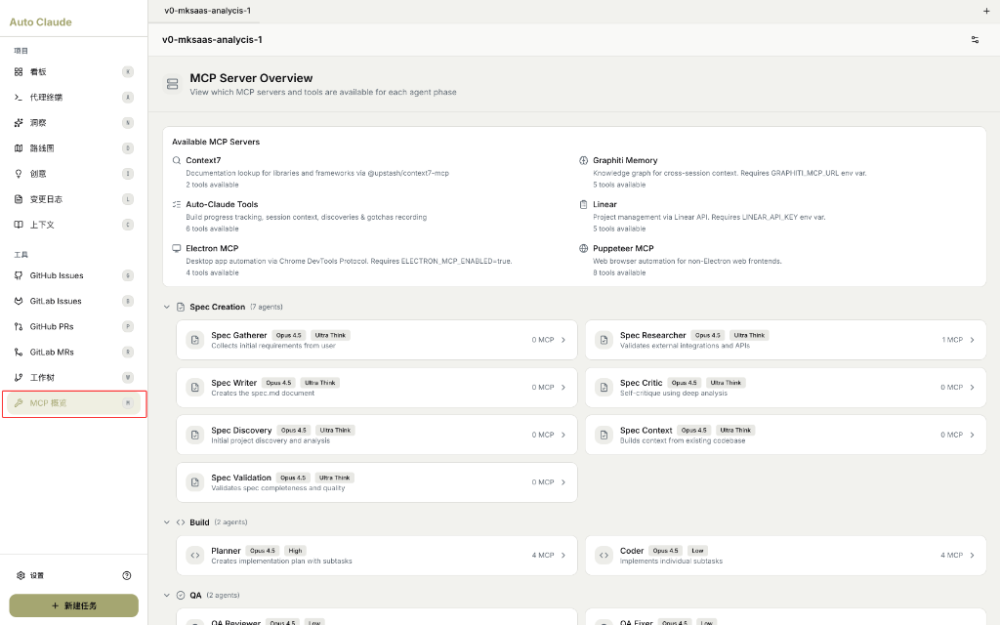

# MCP 概览 (MCP Server Overview)

查看 Auto-Claude 中可用的 MCP 服务器和各阶段 Agent 配置。

---

## 什么是 MCP？

> **MCP** (Model Context Protocol) 是 Anthropic 提出的**模型上下文协议**，用于扩展 AI 的能力。

### MCP 的作用

| 作用 | 说明 |
|------|------|
| **扩展工具** | 让 AI 调用外部工具和 API |
| **访问数据** | 连接数据库、文件系统等 |
| **集成服务** | 对接第三方服务（如 Linear、GitHub） |
| **增强能力** | 浏览器控制、知识图谱等 |

### 简单比喻

```
Claude AI = 大脑（思考能力）
MCP = 手脚（执行能力）

没有 MCP：Claude 只能"说"
有了 MCP：Claude 可以"做"
```

---

## MCP 概览页面



### 界面说明

> "MCP Server Overview"
>
> "View which MCP servers and tools are available for each agent phase"
>
> **翻译**：MCP 服务器概览 - 查看每个 Agent 阶段可用的 MCP 服务器和工具

---

## Available MCP Servers（可用 MCP 服务器）

Auto-Claude 内置 6 个 MCP 服务器：

| 服务器 | 说明 | 工具数 |
|--------|------|--------|
| **Context7** | 文档查询，通过 @upstash/context7-mcp 获取库和框架文档 | 2 tools |
| **Graphiti Memory** | 知识图谱，用于跨会话上下文。需要 `GRAPHITI_MCP_URL` 环境变量 | 5 tools |
| **Auto-Claude Tools** | 内置工具，进度跟踪、会话上下文、发现记录等 | 6 tools |
| **Linear** | 项目管理，通过 Linear API 管理任务。需要 `LINEAR_API_KEY` 环境变量 | 5 tools |
| **Electron MCP** | 桌面自动化，通过 Chrome DevTools 协议控制。需要 `ELECTRON_MCP_ENABLED=true` | 4 tools |
| **Puppeteer MCP** | 浏览器自动化，用于非 Electron 的 Web 前端自动化 | 8 tools |

### 各服务器详解

#### Context7

> "Documentation lookup for libraries and frameworks via @upstash/context7-mcp"
>
> **翻译**：通过 @upstash/context7-mcp 查询库和框架文档

**用途**：让 AI 查阅 React、Vue、Next.js 等框架的官方文档。

#### Graphiti Memory

> "Knowledge graph for cross-session context. Requires GRAPHITI_MCP_URL env var."
>
> **翻译**：用于跨会话上下文的知识图谱。需要 GRAPHITI_MCP_URL 环境变量。

**用途**：持久化 AI 的记忆，跨任务保留学习内容。

#### Auto-Claude Tools

> "Build progress tracking, session context, discoveries & gotchas recording"
>
> **翻译**：构建进度跟踪、会话上下文、发现和注意事项记录

**用途**：Auto-Claude 内部工具，管理任务执行状态。

#### Linear

> "Project management via Linear API. Requires LINEAR_API_KEY env var."
>
> **翻译**：通过 Linear API 进行项目管理。需要 LINEAR_API_KEY 环境变量。

**用途**：同步和管理 Linear 中的任务。

#### Electron MCP

> "Desktop app automation via Chrome DevTools Protocol. Requires ELECTRON_MCP_ENABLED=true."
>
> **翻译**：通过 Chrome DevTools 协议进行桌面应用自动化。需要 ELECTRON_MCP_ENABLED=true。

**用途**：控制 Electron 应用进行 UI 测试。

#### Puppeteer MCP

> "Web browser automation for non-Electron web frontends."
>
> **翻译**：用于非 Electron Web 前端的浏览器自动化。

**用途**：自动化浏览器操作，如截图、填表、点击等。

---

## 什么是 Agent？

> **Agent** 是 Auto-Claude 中执行特定任务的**专业 AI 角色**。

### Agent 的作用

| 概念 | 说明 |
|------|------|
| **Agent** | 具有特定职责的 AI 实例 |
| **角色分工** | 每个 Agent 专注一项任务 |
| **协作流程** | 多个 Agent 按阶段接力工作 |

### 与普通 Claude 的区别

| 方面 | 普通 Claude | Auto-Claude Agent |
|------|-------------|-------------------|
| **职责** | 通用对话 | 专项任务 |
| **工具** | 无 | 配备 MCP 工具 |
| **协作** | 单独工作 | 多 Agent 协作 |
| **持久化** | 无记忆 | 有记忆和上下文 |

---

## Agent 阶段分类

Auto-Claude 将 Agent 分为 3 个阶段：

### 1. Spec Creation（规格创建）- 7 个 Agent

| Agent | 模型 | 思考级别 | MCP | 职责 |
|-------|------|----------|-----|------|
| **Spec Gatherer** | Opus 4.5 | Ultra Think | 0 | 收集用户初始需求 |
| **Spec Researcher** | Opus 4.5 | Ultra Think | 1 | 验证外部集成和 API |
| **Spec Writer** | Opus 4.5 | Ultra Think | 0 | 创建 spec.md 文档 |
| **Spec Critic** | Opus 4.5 | Ultra Think | 0 | 深度分析自我批评 |
| **Spec Discovery** | Opus 4.5 | Ultra Think | 0 | 初始项目发现和分析 |
| **Spec Context** | Opus 4.5 | Ultra Think | 0 | 从现有代码库构建上下文 |
| **Spec Validation** | Opus 4.5 | Ultra Think | 0 | 验证规格完整性和质量 |

### 2. Build（构建）- 2 个 Agent

| Agent | 模型 | 思考级别 | MCP | 职责 |
|-------|------|----------|-----|------|
| **Planner** | Opus 4.5 | High | 4 | 创建实现计划和子任务 |
| **Coder** | Opus 4.5 | Low | 4 | 实现各个子任务 |

### 3. QA（质量保证）- 2 个 Agent

| Agent | 模型 | 思考级别 | MCP | 职责 |
|-------|------|----------|-----|------|
| **QA Reviewer** | Opus 4.5 | Low | - | 代码审查和测试 |
| **QA Fixer** | Opus 4.5 | Low | - | 修复发现的问题 |

---

## Agent 配置说明

### 模型选择

| 模型 | 特点 |
|------|------|
| **Opus 4.5** | 最强模型，深度推理 |
| **Sonnet 4.5** | 平衡模型，速度+质量 |
| **Haiku 4.5** | 快速模型，简单任务 |

### 思考级别

| 级别 | 说明 | 适用场景 |
|------|------|----------|
| **Ultra Think** | 最深思考 | 规格创建、架构设计 |
| **High** | 深度思考 | 规划阶段 |
| **Low** | 快速思考 | 编码执行 |

### MCP 数量

数字表示该 Agent 可使用的 MCP 工具数量：
- **0 MCP**：纯思考，不调用外部工具
- **1+ MCP**：可调用对应数量的 MCP 工具

---

## 如何自定义 Agent？

目前 Agent 配置在系统内置，用户可以：

1. **通过任务创建时选择 Agent Profile** 调整模型和思考级别
2. **在设置中启用/禁用 MCP 服务器** 控制 Agent 可用工具
3. **未来版本** 可能支持自定义 Agent 配置

---

## 相关页面

- [代理终端](../03-ui-guide/agent-terminals.md)
- [任务创建](../03-ui-guide/task-creation.md)
- [上下文](../03-ui-guide/context.md)
