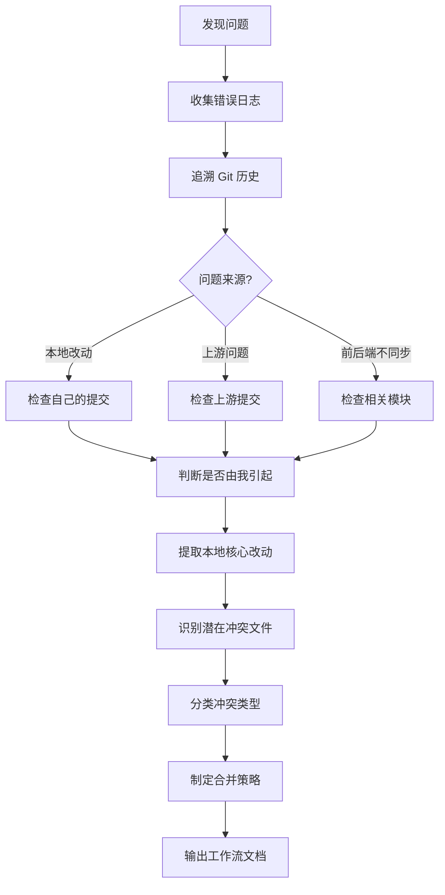

# 上游代码同步问题分析方法论

> **总结自**: Auto-Claude `--base-branch` 问题分析过程
> **适用场景**: Fork 项目的上游同步、代码合并冲突分析

---

## 工作流总览

```
问题发现 → 根因分析 → 改动归属判定 → 冲突评估 → 制定合并策略
```

---

## 第一阶段：问题发现与定位

### 1.1 收集错误信息
- 查看应用日志
- 识别具体的错误信息
- 定位出错的文件和行号

### 1.2 示例
```
spec_runner.py: error: unrecognized arguments: --base-branch master
```

---

## 第二阶段：根因分析

### 2.1 追溯 Git 历史

```bash
# 查找引入问题的提交
git log --oneline -p -S "问题关键字" -- 相关文件

# 查看文件的修改历史
git log --oneline -20 -- 问题文件路径
```

### 2.2 判断问题来源
- **上游引入？** 检查 upstream 的提交历史
- **本地改动引入？** 检查本地的提交历史
- **前后端不同步？** 检查相关模块的修改时间

### 2.3 示例发现
```
关键发现：
- PR #388 在前端添加了 --base-branch 参数
- 但同一 PR 遗漏了后端 spec_runner.py 的更新
- 上游 PR #428 已修复此问题
```

---

## 第三阶段：改动归属判定

### 3.1 核心问题
> 这个问题是我的改动引起的，还是本身就存在的？

### 3.2 分析方法

```bash
# 查看你的改动涉及哪些文件
git diff --name-only $(git merge-base HEAD upstream/develop) HEAD

# 查看问题涉及哪些文件
git log --oneline -p -S "问题关键字" -- "apps/"

# 判断：两者有交集吗？
```

### 3.3 结论模板
| 问题 | 结论 |
|------|------|
| 是否由我的改动引起？ | 是/否 |
| 真正原因 | [描述] |
| 上游是否已修复？ | 是/否 |

---

## 第四阶段：冲突评估

### 4.1 识别本地核心改动

```bash
# 提取本地改动的代码文件
git diff --name-only $(git merge-base HEAD upstream/develop) HEAD -- apps/ tests/
```

### 4.2 识别潜在冲突

```bash
# 找出双方都修改的文件
comm -12 \
  <(git diff --name-only BASE HEAD | sort) \
  <(git diff --name-only BASE upstream/develop | sort)
```

### 4.3 分类冲突类型
| 类型 | 处理方式 |
|------|---------|
| 设计冲突 | 决定保留哪方设计 |
| 代码冲突 | 手动合并 |
| 配置冲突 | 合并配置项 |
| 依赖冲突 | 重新生成 |

---

## 第五阶段：制定合并策略

### 5.1 输出物
1. **核心改动文件清单** - 需要保护的文件
2. **潜在冲突文件清单** - 需要特别处理的文件
3. **设计冲突说明** - 需要强制保留的设计决策
4. **合并命令参考** - 具体执行步骤

### 5.2 合并检查清单
- [ ] 识别所有冲突文件
- [ ] 确定每个冲突的处理策略
- [ ] 对关键文件使用 `--ours` 保护
- [ ] 合并后运行测试验证

---

## 方法论总结



---

## 关键命令速查

```bash
# 1. 查看落后上游多少
git log --oneline HEAD..upstream/develop

# 2. 查看本地改动文件
git diff --name-only $(git merge-base HEAD upstream/develop) HEAD

# 3. 查看上游新增文件
git diff --name-only $(git merge-base HEAD upstream/develop) upstream/develop

# 4. 找出冲突文件
comm -12 <(本地改动 | sort) <(上游改动 | sort)

# 5. 查看特定文件的上游改动
git diff HEAD..upstream/develop -- 文件路径

# 6. 合并时保留本地版本
git checkout --ours 文件路径
```
