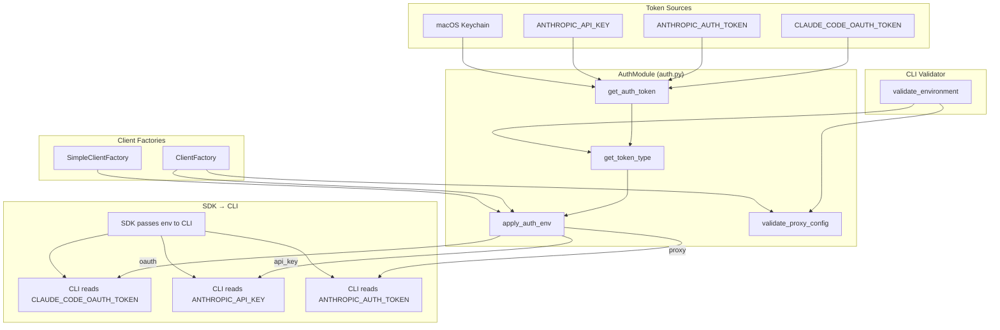

# Feature Design: CLI Multi-Auth Support

## Overview

本设计实现 Auto-Claude CLI 的多认证支持，允许用户使用 OAuth Token、API Key 或 Proxy Token 进行认证。

### 核心设计决策

1. **类型特定注入**: 不同 Token 类型写入对应的环境变量，因为 CLI 从类型特定变量读取认证
2. **最小侵入**: 仅修改认证相关代码，不改变现有安全模型和工作流
3. **向后兼容**: 现有 OAuth 用户无需任何更改

### 与现有系统的关系

```
用户 Token → AuthModule → 类型特定变量 → SDK → CLI
                ↓
         类型识别 + 警告

Token 类型映射:
- OAuth    → CLAUDE_CODE_OAUTH_TOKEN
- API Key  → ANTHROPIC_API_KEY
- Proxy    → ANTHROPIC_AUTH_TOKEN + ANTHROPIC_BASE_URL
```

## Architecture



### Call Flow

```
1. CLIValidator 调用 get_token_type() 识别认证模式（早期验证）
2. CLIValidator 调用 validate_proxy_config() 校验 Proxy 配置（早期失败）
3. ClientFactory/SimpleClientFactory 调用 require_auth_token() 获取 token
4. require_auth_token() 内部调用 get_auth_token() 按优先级解析
5. ClientFactory/SimpleClientFactory 调用 apply_auth_env(token) 注入环境
6. apply_auth_env() 内部调用 get_token_type(token) 识别类型
7. apply_auth_env() 清理冲突变量，写入类型特定环境变量:
   - oauth → CLAUDE_CODE_OAUTH_TOKEN
   - api_key → ANTHROPIC_API_KEY
   - proxy → ANTHROPIC_AUTH_TOKEN
8. ClientFactory 额外调用 validate_proxy_config() 作为二次校验
9. SDK 将环境变量传递给 CLI，CLI 从类型特定变量读取认证
```

## Components and Interfaces

### AuthModule (`core/auth.py`)

```python
# 常量定义
AUTH_TOKEN_ENV_VARS: list[str]  # Token 解析优先级列表
SDK_ENV_VARS: list[str]         # SDK 环境变量传递列表

# 核心函数
def get_token_type(token: str | None) -> str:
    """
    检测 Token 类型。

    Args:
        token: 认证 Token 字符串

    Returns:
        "oauth" | "api_key" | "proxy" | "unknown"
    """
    ...

def apply_auth_env(token: str) -> str:
    """
    设置类型特定认证环境变量。

    关键点: CLI 从类型特定环境变量读取认证:
    - CLAUDE_CODE_OAUTH_TOKEN for OAuth
    - ANTHROPIC_API_KEY for API Key
    - ANTHROPIC_AUTH_TOKEN for Proxy

    Args:
        token: 认证 Token 字符串

    Returns:
        Token 类型字符串
    """
    ...

def validate_proxy_config() -> tuple[bool, str]:
    """
    验证 Proxy 配置完整性。

    Returns:
        (is_valid, error_message)
    """
    ...

def is_api_key_mode() -> bool:
    """检查当前是否使用 API Key 模式。"""
    ...
```

### ClientFactory (`core/client.py`)

```python
def create_client(
    project_dir: Path,
    spec_dir: Path,
    model: str,
    agent_type: str = "coder",
    max_thinking_tokens: int | None = None,
    output_format: dict | None = None,
) -> ClaudeSDKClient:
    """
    创建 Claude Agent SDK 客户端。

    修改点:
    1. 调用 apply_auth_env() 统一注入
    2. 调用 validate_proxy_config() 校验 Proxy 配置
    3. 根据 token_type 显示警告
    """
    ...
```

### SimpleClientFactory (`core/simple_client.py`)

```python
def create_simple_client(
    agent_type: str = "merge_resolver",
    model: str = "claude-haiku-4-5-20251001",
    system_prompt: str | None = None,
    cwd: Path | None = None,
    max_turns: int = 1,
    max_thinking_tokens: int | None = None,
) -> ClaudeSDKClient:
    """
    创建简化 SDK 客户端。

    修改点:
    1. 调用 apply_auth_env() 替换直接写入
    """
    ...
```

### CLIValidator (`cli/utils.py`)

```python
def validate_environment(spec_dir: Path) -> bool:
    """
    验证 CLI 环境配置。

    修改点:
    1. 调用 get_token_type() 识别认证模式
    2. 调用 validate_proxy_config() 校验 Proxy
    3. 根据 token_type 显示不同提示
    """
    ...
```

## Data Models

### Token Type Enum (概念)

```python
TokenType = Literal["oauth", "api_key", "proxy", "unknown"]
```

### Token Prefix Patterns

| Type | Prefixes | Example |
|------|----------|---------|
| oauth | `sk-ant-oat01-`, `sk-ant-oat` | `sk-ant-oat01-abc123...` |
| api_key | `sk-ant-api`, `sk-` (excluding oat) | `sk-ant-api03-xyz789...` |
| proxy | `pc_`, `ccr-` | `pc_abc123...` |

### Environment Variable Mapping

| Token Type | Target Variable | Additional |
|------------|-----------------|------------|
| oauth | `CLAUDE_CODE_OAUTH_TOKEN` | - |
| api_key | `ANTHROPIC_API_KEY` | - |
| proxy | `ANTHROPIC_AUTH_TOKEN` | `ANTHROPIC_BASE_URL` (required) |

**Note - CLI Authentication Behavior**: The Claude Code CLI reads authentication from type-specific environment variables. The SDK passes these variables to the CLI subprocess via the `env` parameter.

## Correctness Properties

### Prework: Testability Analysis

```
1.1 OAuth token classification
  Thoughts: Token prefix matching is deterministic, can test with various prefixes
  Testable: yes - property

1.2 API Key token classification
  Thoughts: Token prefix matching is deterministic, need to check sk-ant-api first, then sk- (excluding oat prefix)
  Testable: yes - property

1.3 Proxy token classification
  Thoughts: Token prefix matching is deterministic
  Testable: yes - property

1.4 Unknown token classification
  Thoughts: Fallback case for unrecognized patterns
  Testable: yes - property

2.1 Type-specific injection
  Thoughts: Each token type must be written to its corresponding variable
  Testable: yes - property

2.2 Conflicting variable cleanup
  Thoughts: Must clear all auth variables before injection
  Testable: yes - property

3.1 Priority resolution
  Thoughts: Deterministic priority order
  Testable: yes - property

4.1 Proxy validation - missing base URL
  Thoughts: Error condition, deterministic
  Testable: yes - property

4.2 Proxy validation - with base URL
  Thoughts: Success condition
  Testable: yes - property

5.1 API Key warning display
  Thoughts: UI output, can capture stdout
  Testable: yes - example

8.1 Backward compatibility
  Thoughts: Existing OAuth flow unchanged
  Testable: yes - property
```

### Property Reflection

- Properties 1.1-1.4 can be combined into a single "Token Classification" property
- Properties 2.1-2.2 are distinct: type-specific injection vs cleanup
- Property 3.1 is independent
- Properties 4.1-4.2 can be combined into "Proxy Validation" property

### Correctness Properties

**Property 1: Token Classification Correctness**

*For any* token string, the `get_token_type` function SHALL return:
- `"oauth"` if and only if the token starts with `sk-ant-oat01-` or `sk-ant-oat`
- `"api_key"` if and only if the token starts with `sk-ant-api`, OR (starts with `sk-` AND does NOT start with `sk-ant-oat`)
- `"proxy"` if and only if the token starts with `pc_` or `ccr-`
- `"unknown"` for all other cases

**Note**: The check order is critical - OAuth prefixes MUST be checked before the generic `sk-` prefix.

**Validates: Requirements 1.1, 1.2, 1.3, 1.4**

---

**Property 2: Type-Specific Environment Injection**

*For any* valid token string, after calling `apply_auth_env(token)`:
- IF token type is `oauth`, THEN `CLAUDE_CODE_OAUTH_TOKEN` SHALL equal the input token
- IF token type is `api_key`, THEN `ANTHROPIC_API_KEY` SHALL equal the input token
- IF token type is `proxy`, THEN `ANTHROPIC_AUTH_TOKEN` SHALL equal the input token
- IF token type is `unknown`, THEN `CLAUDE_CODE_OAUTH_TOKEN` SHALL equal the input token (fallback behavior)

**Validates: Requirements 2.1, 2.2, 2.3**

---

**Property 3: Conflicting Variable Cleanup**

*For any* initial environment state with conflicting auth variables, after calling `apply_auth_env(token)`:
- IF token type is `oauth`, THEN `ANTHROPIC_API_KEY` and `ANTHROPIC_AUTH_TOKEN` SHALL be unset
- IF token type is `api_key`, THEN `CLAUDE_CODE_OAUTH_TOKEN` and `ANTHROPIC_AUTH_TOKEN` SHALL be unset
- IF token type is `proxy`, THEN `CLAUDE_CODE_OAUTH_TOKEN` and `ANTHROPIC_API_KEY` SHALL be unset
- IF token type is `unknown`, THEN `ANTHROPIC_API_KEY` and `ANTHROPIC_AUTH_TOKEN` SHALL be unset

**Validates: Requirements 2.4**

---

**Property 4: Priority Resolution Determinism**

*For any* environment with multiple auth tokens set, `get_auth_token()` SHALL return the token from the highest priority source: `CLAUDE_CODE_OAUTH_TOKEN` > `ANTHROPIC_AUTH_TOKEN` > `ANTHROPIC_API_KEY`.

**Validates: Requirements 3.1, 3.2**

---

**Property 5: Proxy Validation Completeness**

*For any* proxy token (type `"proxy"`), `validate_proxy_config()` SHALL return `(False, error_message)` if and only if `ANTHROPIC_BASE_URL` is not set.

**Validates: Requirements 4.1, 4.2**

---

**Property 6: Backward Compatibility**

*For any* OAuth token retrieved via the previous implementation path (environment variable or Keychain), the new implementation SHALL produce identical SDK authentication behavior.

**Validates: Requirements 8.1, 8.2, 8.3**

## Error Handling

### Error Types

| Error | Condition | Message |
|-------|-----------|---------|
| `ValueError` | No token found | Multi-line guidance for all auth methods |
| `ValueError` | Proxy without base URL | "Proxy token detected but ANTHROPIC_BASE_URL is not set" |

### Error Recovery

- Token not found: User must configure one of three auth methods
- Proxy misconfiguration: User must set `ANTHROPIC_BASE_URL`

## Testing Strategy

### Unit Tests

1. `test_get_token_type_oauth`: Test OAuth prefix detection
2. `test_get_token_type_api_key`: Test API Key prefix detection
3. `test_get_token_type_proxy`: Test Proxy prefix detection
4. `test_get_token_type_unknown`: Test unknown fallback
5. `test_apply_auth_env_clears_conflicts`: Test variable cleanup
6. `test_validate_proxy_config_missing_url`: Test Proxy validation failure
7. `test_validate_proxy_config_with_url`: Test Proxy validation success

### Property Tests (using Hypothesis)

```python
from hypothesis import given, strategies as st
import os

# Property 1: Token Classification
@given(st.text())
def test_token_classification_exhaustive(token):
    result = get_token_type(token)
    assert result in ("oauth", "api_key", "proxy", "unknown")

    # Verify classification rules (order matters!)
    if token.startswith("sk-ant-oat01-") or token.startswith("sk-ant-oat"):
        assert result == "oauth"
    elif token.startswith("sk-ant-api"):
        assert result == "api_key"
    elif token.startswith("sk-") and not token.startswith("sk-ant-oat"):
        assert result == "api_key"
    elif token.startswith("pc_") or token.startswith("ccr-"):
        assert result == "proxy"
    else:
        assert result == "unknown"

# Property 2: Type-Specific Injection
@given(st.text(min_size=1))
def test_type_specific_injection(token):
    # Clear environment first
    for var in ["CLAUDE_CODE_OAUTH_TOKEN", "ANTHROPIC_API_KEY", "ANTHROPIC_AUTH_TOKEN"]:
        os.environ.pop(var, None)

    token_type = apply_auth_env(token)

    # Verify type-specific injection
    if token_type == "oauth":
        assert os.environ.get("CLAUDE_CODE_OAUTH_TOKEN") == token
        assert "ANTHROPIC_API_KEY" not in os.environ
        assert "ANTHROPIC_AUTH_TOKEN" not in os.environ
    elif token_type == "api_key":
        assert os.environ.get("ANTHROPIC_API_KEY") == token
        assert "CLAUDE_CODE_OAUTH_TOKEN" not in os.environ
        assert "ANTHROPIC_AUTH_TOKEN" not in os.environ
    elif token_type == "proxy":
        assert os.environ.get("ANTHROPIC_AUTH_TOKEN") == token
        assert "CLAUDE_CODE_OAUTH_TOKEN" not in os.environ
        assert "ANTHROPIC_API_KEY" not in os.environ
    else:  # unknown - fallback to oauth variable
        assert os.environ.get("CLAUDE_CODE_OAUTH_TOKEN") == token
```

### Test Framework

- **Unit Tests**: pytest
- **Property Tests**: Hypothesis (Python)
- **Iterations**: 100+ per property test
