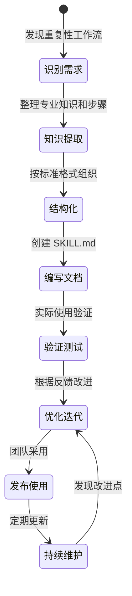

# Claude Code Skills 方法论详解

## 概述

Claude Code Skills 是一种**知识封装与工作流自动化**的方法论，核心目标是：

1. 将隐性的专业知识转化为显性的、可复用的指令文档
2. 标准化重复性工作流程，提高执行效率和一致性
3. 通过结构化的检查清单确保质量和完整性
4. 实现团队知识的传承和积累

## 核心理念

### 1. 知识即代码 (Knowledge as Code)

就像代码可以复用一样，专业知识也应该被结构化、版本化、可复用：

```
传统方式：知识在人脑中 → 每次都要重新思考 → 容易遗漏步骤
Skills 方式：知识在文档中 → 一次编写，多次调用 → 标准化执行
```

### 2. 工作流驱动 (Workflow-Driven)

Skills 不是简单的文档，而是**可执行的工作流**：

- 明确的步骤顺序
- 清晰的输入输出
- 内置的验证检查点
- 标准化的执行路径

### 3. 渐进式复杂度 (Progressive Complexity)

Skills 支持从简单到复杂的渐进式设计：

```
Level 1: 单文件 SKILL.md - 简单工作流
Level 2: SKILL.md + operations/ - 复杂多步骤流程
Level 3: 多个相关 Skills 组合 - 完整的方法论体系
```

## 设计哲学

### 为什么需要 Skills?

**问题场景**：
- 每次做代码审查都要重新思考检查项
- 不同团队成员的操作标准不一致
- 新人需要长时间学习才能掌握最佳实践
- 复杂流程容易遗漏关键步骤

**Skills 解决方案**：
- 将最佳实践固化为标准工作流
- 通过 `/skill-name` 一键调用
- 内置检查清单确保完整性
- 新人可以立即按照标准执行

### Skills vs 传统文档

| 方面 | 传统文档 | Claude Code Skills |
|------|----------|-------------------|
| 组织方式 | 自由格式 | 标准化结构 |
| 调用方式 | 手动查找阅读 | `/skill-name` 命令 |
| 可执行性 | 需要人工解释 | AI 直接执行 |
| 验证机制 | 无 | 内置检查清单 |
| 更新维护 | 容易过时 | 版本控制 |
| 知识传承 | 依赖培训 | 自动化传承 |

## 工作流程

### Skill 的生命周期



### 创建 Skill 的标准流程

#### 阶段 1: 需求识别

**目标**: 确定哪些工作流适合封装为 Skill

**判断标准**:
- ✅ 重复性高（每周/每月执行多次）
- ✅ 步骤固定（有明确的操作顺序）
- ✅ 需要专业知识（不是所有人都熟悉）
- ✅ 容易出错（遗漏步骤或操作不当）
- ✅ 有验证标准（可以检查是否正确完成）

**示例场景**:
- 版本发布流程
- 代码审查检查清单
- SEO 优化步骤
- 数据库迁移流程
- 安全审查清单

#### 阶段 2: 知识提取

**目标**: 将隐性知识显性化

**提取方法**:
1. **观察记录** - 记录专家实际操作步骤
2. **访谈提炼** - 询问"为什么这样做"
3. **案例分析** - 分析成功和失败的案例
4. **文档整合** - 整合现有的零散文档
5. **最佳实践** - 提炼行业最佳实践

**输出内容**:
- 完整的操作步骤列表
- 每个步骤的目的和原因
- 常见错误和注意事项
- 验证检查点
- 相关工具和命令

#### 阶段 3: 结构化组织

**目标**: 按照标准格式组织知识

**标准章节**:
1. **Quick Reference** - 快速参考（最常用的信息）
2. **Standard Workflow** - 标准工作流（分步骤）
3. **Common Scenarios** - 常见场景（实际案例）
4. **Critical Rules** - 关键规则（ALWAYS/NEVER）
5. **Verification Checklist** - 验证清单（质量保证）
6. **Reference Commands** - 参考命令（工具使用）

**组织原则**:
- 从概览到细节
- 从常用到特殊
- 从必须到可选
- 从简单到复杂

#### 阶段 4: 编写文档

**目标**: 创建清晰、可执行的 SKILL.md

**编写要点**:
- 使用主动语态和祈使句
- 每个步骤都可独立理解
- 提供具体的命令和示例
- 说明每个步骤的目的
- 标注可选步骤和必需步骤

**质量标准**:
- [ ] 新人能够按照文档独立执行
- [ ] 每个步骤都有明确的输入输出
- [ ] 包含错误处理和异常情况
- [ ] 提供验证方法确认完成
- [ ] 文档语言清晰无歧义

#### 阶段 5: 验证测试

**目标**: 确保 Skill 实际可用

**测试方法**:
1. **自我测试** - 作者按照文档执行一遍
2. **新人测试** - 让不熟悉的人尝试执行
3. **实际场景** - 在真实项目中使用
4. **边界测试** - 测试异常情况和边界条件
5. **反馈收集** - 收集使用者的意见

**验证清单**:
- [ ] 所有步骤都能成功执行
- [ ] 验证检查清单有效
- [ ] 没有遗漏关键步骤
- [ ] 错误处理完善
- [ ] 文档表述清晰

#### 阶段 6: 优化迭代

**目标**: 根据反馈持续改进

**优化方向**:
- 简化复杂步骤
- 补充遗漏内容
- 更新过时信息
- 改进表述清晰度
- 添加更多示例

**迭代触发条件**:
- 用户反馈问题
- 发现新的最佳实践
- 工具或技术更新
- 流程变更
- 定期审查（如每季度）

## Skills 的分类

### 按复杂度分类

#### 1. 简单型 Skills
- 单文件 SKILL.md
- 5-10 个步骤
- 无复杂分支逻辑
- 适合：快速检查清单、简单流程

**示例**: `/format-code`, `/run-tests`

#### 2. 标准型 Skills
- SKILL.md + 少量 operations
- 10-20 个步骤
- 有条件分支
- 适合：标准开发流程、审查流程

**示例**: `/code-review`, `/version-bump`

#### 3. 复杂型 Skills
- SKILL.md + 多个 operations
- 20+ 个步骤
- 多个子流程
- 适合：完整的方法论、复杂系统操作

**示例**: `/seo-strategy`, `/security-audit`

### 按用途分类

#### 1. 开发流程类
- 代码审查
- 版本发布
- 分支管理
- 代码重构

#### 2. 质量保证类
- 测试策略
- 安全审查
- 性能优化
- 代码质量检查

#### 3. 运维部署类
- 部署流程
- 数据库迁移
- 环境配置
- 监控告警

#### 4. 文档管理类
- 文档更新
- API 文档生成
- 架构文档维护
- 变更日志管理

#### 5. 专业领域类
- SEO 优化
- 可访问性审查
- 国际化处理
- 数据隐私合规

## 与其他方法论的关系

### Skills + Kiro Specs

**协同使用场景**:
```
/kiro-init → 初始化 Kiro Specs 文档结构
/kiro-requirements → 辅助编写符合 EARS 标准的需求
/kiro-design → 辅助编写包含正确性属性的设计
/kiro-tasks → 辅助生成任务清单
```

**互补关系**:
- Kiro Specs: 定义"做什么"（需求、设计、任务）
- Skills: 定义"怎么做"（工作流、步骤、检查）

### Skills + Agent Foreman

**协同使用场景**:
```
/agent-foreman:init → 初始化项目框架
/agent-foreman:next → 获取下一个任务
/code-review → 审查实现的代码
/agent-foreman:done → 标记任务完成
```

**互补关系**:
- Agent Foreman: 任务管理和进度追踪
- Skills: 具体任务的执行指南

## 最佳实践原则

### 1. 单一职责原则
每个 Skill 只专注于一个明确的工作流，不要试图在一个 Skill 中包含太多内容。

**好的示例**:
- `/version-bump` - 只处理版本号更新
- `/changelog-update` - 只处理变更日志

**不好的示例**:
- `/release` - 包含版本更新、变更日志、构建、部署等所有内容

### 2. 渐进式披露原则
在主文档中提供概览和常用信息，详细内容放在 operations 子目录。

**结构示例**:
```
SKILL.md - 快速参考 + 标准流程（80% 的使用场景）
operations/advanced.md - 高级用法（15% 的使用场景）
operations/troubleshooting.md - 故障排查（5% 的使用场景）
```

### 3. 可验证性原则
每个关键步骤都应该有验证方法，确保正确完成。

**验证方式**:
- 命令输出检查
- 文件内容验证
- 测试执行结果
- 人工审查确认

### 4. 容错性原则
考虑异常情况和错误处理，提供恢复方法。

**包含内容**:
- 常见错误及解决方法
- 回滚步骤
- 安全检查点
- 紧急处理流程

### 5. 可维护性原则
文档应该易于更新和扩展。

**维护要点**:
- 使用清晰的章节结构
- 避免硬编码具体值
- 提供配置说明
- 标注版本和更新日期

## 成功指标

一个好的 Skill 应该达到以下标准：

### 可用性指标
- [ ] 新人能够在 5 分钟内理解如何使用
- [ ] 按照文档执行的成功率 > 95%
- [ ] 平均执行时间减少 50% 以上

### 质量指标
- [ ] 遗漏关键步骤的概率 < 5%
- [ ] 执行结果的一致性 > 90%
- [ ] 用户满意度 > 4/5

### 维护指标
- [ ] 每季度至少审查一次
- [ ] 用户反馈响应时间 < 1 周
- [ ] 文档更新频率与技术变化同步

## 常见陷阱

### ❌ 避免的错误

1. **过度复杂化** - 试图在一个 Skill 中包含所有可能的情况
2. **缺乏验证** - 没有提供检查步骤是否正确完成的方法
3. **假设知识** - 假设用户已经知道某些背景知识
4. **模糊表述** - 使用"可能"、"通常"等不确定的词汇
5. **缺乏示例** - 只有抽象描述，没有具体示例
6. **忽略错误** - 没有考虑异常情况和错误处理
7. **过时信息** - 文档没有随着技术更新而更新

### ✅ 正确的做法

1. **保持简单** - 专注于核心工作流，复杂内容放到 operations
2. **内置验证** - 每个关键步骤都有验证方法
3. **明确前提** - 在开头说明需要的背景知识和准备工作
4. **精确表述** - 使用"必须"、"应该"等明确的词汇
5. **丰富示例** - 提供实际的命令、代码和输出示例
6. **完善错误处理** - 包含常见错误和解决方法
7. **定期维护** - 建立定期审查和更新机制

## 总结

Claude Code Skills 方法论的核心价值在于：

1. **知识资产化** - 将隐性知识转化为可复用的资产
2. **流程标准化** - 确保团队执行的一致性
3. **效率提升** - 减少重复思考和查找的时间
4. **质量保证** - 通过检查清单降低错误率
5. **知识传承** - 新人可以快速掌握最佳实践

通过系统化地应用这套方法论，可以显著提升团队的开发效率和代码质量。
